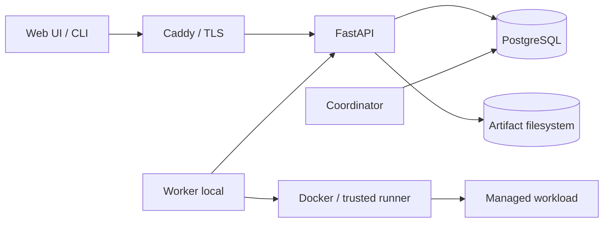

# PLAN — nexa / PBL4

Cập nhật: 16/09/2026. **Tài liệu này là nguồn sự thật duy nhất về phạm vi, kiến trúc và nghiệm thu của dự án.** ADR, API contract, README và runbook được triển khai theo tài liệu này; thay đổi quyết định phải cập nhật PLAN trước. Đây là kế hoạch, chưa phải bằng chứng hoàn thành hay kết quả benchmark.

## 1. Sản phẩm và đầu ra

> Nền tảng single-node, self-hosted và hardware-portable để chạy batch job AI cho nhiều người dùng trên một Linux server, phân phối CPU, RAM và GPU công bằng, đồng thời tiếp tục job từ application checkpoint sau sự cố.

Mỗi deployment quản lý **một Linux server tại một thời điểm**. Cùng bản release cài độc lập được trên các server có cấu hình khác nhau. Tên làm việc là `nexa`; không yêu cầu đổi tên repository.

Một sản phẩm cuối, một GitHub Release **`v1.0.0`**, gồm REST API, CLI, Web UI tối thiểu, scheduler, worker Docker, PostgreSQL, kho artifact/checkpoint filesystem bền vững, workload PyTorch mẫu, Docker Compose, demo runbook và báo cáo benchmark kèm dữ liệu thô.

## 2. Phạm vi và cam kết

| Trong phạm vi bắt buộc | Ranh giới |
|---|---|
| Nhiều tenant/user, membership, role, quota, trọng số | Admin tạo danh tính và cấp quyền; tenant là miền cách ly |
| CPU, RAM, GPU nguyên chiếc; batch hữu hạn | Chỉ cấp tài nguyên thực tế của worker local; không suy ra concurrency từ số job trong queue |
| CPU mẫu, PyTorch training nhỏ, sweep, inference theo chunk | Template, image digest, adapter và tham số do admin cho phép |
| Fairness, aging, reservation, admission/backpressure | Một thuật toán sản phẩm tại mục 5 |
| Logical recovery và application checkpoint | At-least-once trong ngân sách retry; chỉ một final result được công nhận |
| API, CLI, Web UI | Cùng authorization và REST contract; Web UI là bắt buộc |
| Cài sạch, portability, di chuyển deployment có dừng | Hai môi trường cài độc lập; chỉ resume khi tương thích |
| Load, fairness, recovery, security, UI và portability tests | Chỉ nghiệm thu khi các gate bắt buộc đạt |

**Failure scope:** chịu process crash, mất kết nối tạm thời và reboot khi dữ liệu bền vững còn nguyên. Không có availability khi server duy nhất đang tắt; mất ổ đĩa hoặc corruption cần backup, không được bảo đảm bởi retry. Metadata đã xác nhận có RPO bằng 0 trong failure scope nếu durability PostgreSQL và storage được giữ.

**Giới hạn thực thi:** không nhận code, shell command, image hoặc host mount tùy ý; workload không được tự ghi hệ thống bên ngoài. Không cam kết exactly-once tổng quát hay phục hồi heap, socket, terminal và CUDA context tùy ý. Các hướng mở rộng ngoài phạm vi chỉ nằm tại mục 15 và không có task trong backlog chính.

## 3. Kiến trúc, stack và contract

| Thành phần | Quyết định đã khóa |
|---|---|
| Backend / coordinator / worker / CLI | Python 3.12; FastAPI, SQLAlchemy 2/psycopg, Typer; dependency bằng `uv` và lockfile |
| Persistence | PostgreSQL 17 với durability chuẩn; migration Alembic |
| Execution / deployment | Docker executor; Docker Compose bootstrap toàn bộ deployment và một worker local |
| Web UI | React, TypeScript, Vite; Node.js LTS và `pnpm` có lockfile |
| Kiểm thử / chất lượng | Pytest, Hypothesis, Playwright; Ruff; TypeScript typecheck |
| Quan sát | Prometheus-compatible metrics và structured JSON logs |
| Phát hành | GitHub Actions, GHCR; image theo version và digest |
| Truy cập | Caddy phục vụ UI và TLS, proxy API; DB, metrics và Docker socket chỉ trong mạng quản trị |

API và coordinator là các process riêng của **một modular monolith**. Worker chỉ giao tiếp API; chỉ worker được truy cập Docker socket. Interface nội bộ: `SchedulerPolicy`, `ResourceProvider`, `Executor`, `WorkloadAdapter`, `ArtifactStore`. Scheduler không import PyTorch.

**Nguồn sự thật:** PostgreSQL giữ tenant/user/membership/token, job/session/attempt, queue, allocation/GPU UUID, lease, quota, fairness ledger, admission counter, idempotency, audit/event và artifact metadata. File input/checkpoint/result và log đã chốt bất biến nằm trên persistent filesystem. Cache và min-heap chỉ tăng tốc, được tái dựng từ DB.

| Domain và invariant | Contract |
|---|---|
| Job / session / attempt | Một job có một session logic; spec/input/digest bất biến. Recovery hoặc resume tạo attempt mới trong cùng job/session |
| Terminal và manual retry | `SUCCEEDED/FAILED/CANCELLED` bất biến. Manual retry job failed tạo job/session mới, có `retry_of_job_id`; checkpoint hợp lệ được kế thừa bằng tham chiếu |
| Capacity / quota | Tổng allocation chưa release không vượt capacity/quota; GPU UUID thuộc tối đa một allocation chưa release |
| Quyền thực thi | Tối đa một attempt được cấp quyền/job; job fence tăng đơn điệu; lease hết hạn không chứng minh container đã dừng |
| Kết quả | Unique final result theo job; mọi publish kiểm tra worker epoch, attempt, fence, lease và desired state |
| Ownership | Tenant ownership tại mọi query/download và composite reference; không nhận đường dẫn filesystem từ client |
| Nhất quán | Job, event sequence, counter và idempotency commit cùng transaction; request/callback lặp không đếm hai lần |
| Leadership | Coordinator lease/epoch riêng, worker incarnation riêng, job fence riêng; đổi coordinator không vô hiệu hóa attempt khỏe |

**API `/v1`:**

| Nhóm | Endpoint / hành vi |
|---|---|
| Auth / template | Login/logout/session; catalog template và schema tham số theo quyền |
| Artifact | `POST /artifacts` stream có checksum/size và idempotency; `GET /artifacts/{id}` kiểm tra ownership |
| Job / session | `POST /jobs`; list/filter/cursor; `GET /jobs/{id}`, `GET /sessions/{id}`; attempts, checkpoints, logs, events sau sequence |
| Control | `POST /jobs/{id}/{cancel,pause,resume,retry}`: idempotency và `If-Match`; pause/resume theo capability |
| Admin | Tenant/user/membership; quota/weight có version; local worker capacity/allocation, drain/disable; audit/fairness/recovery queries |
| Worker | Bootstrap identity local, heartbeat/poll; attempt claim/start/renew/checkpoint/complete/cleanup có epoch/fence và callback deduplication |

Submit: xác minh input committed, template, compatibility và khả năng vừa capacity/quota; khóa counter; ghi job/session/event/idempotency; trả `202` **sau commit**. Cùng key/payload trả cùng kết quả; khác payload trả `409`. Idempotency scope là tenant + principal + operation + key, kiểm tra replay trước `If-Match`; giữ key khi job hoạt động và ít nhất 30 ngày sau terminal. Version sai trả `412`.

Mọi lỗi có `code`, thông báo an toàn và `request_id`: `429` khi vượt rate/quota số job, `503 queue_full/dependency_unavailable`, kèm `Retry-After`; `422 infeasible_request` khi không thể vừa hoặc sai capability. Worker offline nhưng cấu hình pool hợp lệ vẫn nhận trong giới hạn, hiển thị `waiting_for_worker`. Không có GPU được cấu hình thì từ chối request GPU.

## 4. Hardware portability và di chuyển deployment

Worker tự phát hiện CPU millicore, RAM byte, GPU inventory/UUID/capability nếu có, kiến trúc máy, Docker/cgroups/runtime và adapter tương thích. Capacity cấp job trừ dự phòng OS/control plane: CPU dự phòng ít nhất 1 core và 20% host CPU; RAM ít nhất 2 GiB và 20% host RAM. Config có thể tăng dự phòng; không cấp âm hoặc vượt thực tế.

Không viết cứng CPU/RAM/GPU UUID, hostname/IP, đường dẫn máy phát triển, capacity benchmark hay driver không cần thiết. Release manifest khai báo kiến trúc của từng image (`linux/amd64`, `linux/arm64`); preflight đối chiếu host với artifact đã phát hành. Chỉ công bố hỗ trợ kiến trúc đã build/test, không giả định image chạy được trên mọi máy. Workload GPU khai báo riêng framework/CUDA/driver capability; thiếu capability thì fail preflight, không fallback âm thầm.

**Portability acceptance:**

1. Dùng cùng Git tag và release artifacts cài độc lập trên **hai cấu hình Linux khác nhau**, tuần tự hoặc đồng thời.
2. Không sửa source; chỉ thay cấu hình môi trường. Hai máy không dùng chung control plane.
3. Đối chiếu inventory worker với host; kiểm tra reserve, quota và container CPU/RAM limits.
4. Submit CPU workload, nhận result, khởi động lại và xác minh state bền vững trên từng môi trường.
5. Ghi cấu hình/capability, image digest theo kiến trúc và kết quả. Nếu có NVIDIA GPU, chạy gate GPU mục 14.

**Di chuyển có dừng:** ngừng admission → drain hoặc pause/checkpoint job → xác nhận container dừng, khóa ghi metadata/artifact → backup PostgreSQL và artifact cùng manifest nhất quán → cài cùng release trên máy mới → restore → cập nhật inventory/worker incarnation, reconciliation → kiểm tra checksum và compatibility → mở admission, resume job hợp lệ. Host cũ phải giữ tắt execution để tránh hai bản deployment cùng chạy.

Job không vừa capacity/quota mới hoặc không tương thích image/kiến trúc/framework/GPU/driver phải ở trạng thái chặn với lý do, không tự resume. Quy trình có downtime, không bảo đảm tiếp tục mọi job giữa môi trường không tương thích. Upgrade dùng maintenance và backup tương tự; smoke test trước mở ghi. Sau khi đã nhận dữ liệu mới, không hứa rollback không mất dữ liệu bằng snapshot cũ.

## 5. Thuật toán fairness duy nhất

**Weighted dominant resource-time scheduling + quota + aging**, bổ sung một reservation chống starvation. Đây là heuristic được chọn cho batch hữu hạn của dự án, không phải tuyên bố tối ưu cho mọi workload.

Với capacity có thể cấp \(C_r\), allocation tenant \(A_{i,r}\), weight \(w_i>0\):

\[
d_i(t)=\max_{r:C_r>0}\frac{A_{i,r}(t)}{C_r},\qquad
V_i(t+\Delta)=V_i(t)+\frac{d_i(t)\Delta}{w_i}.
\]

Charge allocation đã giữ, gồm thời gian chưa xác nhận release, không dùng utilization tự khai báo. GPU cấp nguyên chiếc theo UUID. Ledger bền vững được account tại allocation/release và tick tối đa 1 giây; khôi phục từ allocation timeline sau restart, không charge hai lần. Tenant chuyển từ không có nhu cầu sang có nhu cầu được đặt \(V_i\) ít nhất bằng virtual floor hiện tại; không reset lịch sử để lấy lợi thế.

| Bước | Quy tắc deterministic |
|---|---|
| 1. Eligibility | Job queued, hết backoff, template/worker tương thích, request vừa tổng capacity và hard quota; kiểm tra slot/concurrency trước dispatch |
| 2. Tenant | Trong tenant có candidate đủ điều kiện, chọn \(V_i\) nhỏ nhất; hòa thì dominant share/weight hiện tại, rồi ready sequence cũ nhất |
| 3. Job | Trong tenant, priority hiệu dụng giảm dần rồi FIFO. Priority gốc 0/1/2, mặc định 1; mỗi 60 giây chờ đủ điều kiện tăng một mức, tối đa 2 |
| 4. Fit | Có thể chọn candidate khác vừa tài nguyên rảnh; job bị bỏ qua giữ tuổi chờ. Không bỏ qua vô hạn job lớn |
| 5. Reservation | Sau 120 giây chờ đủ điều kiện, job cũ nhất khả thi của tenant được bảo vệ. Chọn tenant bằng cùng fairness score; nếu job chưa vừa phần rảnh, giữ một reservation local và dừng dispatch mới để drain. Đủ tài nguyên thì chạy job, bỏ reservation |
| 6. Commit | Khóa/check lại leadership epoch/lease, policy/job version, quota, capacity, GPU UUID và job fence; tạo attempt/allocation nguyên tử. Không gọi Docker trong transaction |

Reservation không dùng FIFO toàn cục thay thế weighted tenant selection khi queue già. Nếu reservation không còn hợp lệ do cancel, policy hay capability thì bỏ và ghi reason. Khi worker/storage khỏe, weight dương, quota ổn định, job vừa máy và runtime hữu hạn, reservation phải vượt bài job lớn bị job nhỏ đến liên tục; không tuyên bố một giới hạn chờ chung chưa được chứng minh.

**Truy cập queue ở quy mô nghiệm thu:** lưu head theo tenant/priority; index partial/composite theo state, tenant, ready sequence, retry time và thời điểm aging. Mỗi tick lấy tối đa 16 candidate/tenant cùng oldest eligible candidate cho reservation; duy trì min-heap theo score. Promotion aging/retry xử lý theo index, batch có giới hạn; cursor công bằng tiếp tục từ batch trước. Decision phụ thuộc số tenant \(T\) và candidate giới hạn \(K\), khoảng \(O(TK+T\log T)\) cộng index lookup; không scan/sort toàn bộ queue. Heap tái dựng từ DB; list/event/API dùng keyset/cursor, không offset pagination bảng lớn.

**Quota/admission mặc định, điều chỉnh bằng policy có version:**

| Giới hạn | Mặc định / quy tắc |
|---|---|
| Outstanding | Global 100.000; tenant 2.000; user 2.000; paused cũng chiếm slot |
| Attempt đồng thời | Tối đa 2/tenant, 1/user, còn bị giới hạn bởi capacity và resource request |
| Resource tenant | CPU/RAM tối đa 50% capacity cấp job; GPU tối đa 1 nếu host có GPU; admin cấu hình theo bài đo |
| Submit rate | Tenant 5/s burst 20; user 2/s burst 10; token bucket bền vững; replay không tiêu thụ thêm |
| Policy update | Từ chối giảm quota thấp hơn allocation/counter đang giữ; drain trước. Không vay tài nguyên vượt hard quota |

RR, WRR, DRR, DRF và FIFO chỉ là **baseline simulator**, không phải chế độ scheduler sản phẩm. So sánh cùng seed, arrival trace, capacity và quota; cost/estimate của baseline phải công bố.

## 6. Quy mô và bằng chứng nghiệm thu

Chỉ có **một profile tải bắt buộc** dưới đây. Tất cả là **benchmark objective, chưa phải kết quả đã đạt**.

| Chỉ tiêu | Acceptance |
|---|---|
| Quy mô | 100 tenant; 100 người dùng giả lập đồng thời; ít nhất 100.000 job queued/chưa kết thúc |
| Tốc độ / API | 100 job được tiếp nhận mỗi giây; submit API p95 ≤ 500 ms trên máy công bố; đo riêng lỗi/backpressure và latency endpoint đọc |
| Fairness | Weighted Jain ≥ 0,95 trong cửa sổ các tenant liên tục có nhu cầu, profile tài nguyên tương đương và quota cho phép tỷ lệ weight |
| Correctness | 0 accepted job mất truy vết; 0 duplicate/stale final result được công nhận |
| Starvation | Mọi job đủ điều kiện trong workload chuẩn cuối cùng được dispatch; ghi max wait và reservation timeline |
| Recovery | Worker crash tiếp tục từ checkpoint; API/coordinator restart giữ queue/state; không reset fairness ledger |

Fairness dùng \(x_i=S_i/w_i\), với \(S_i\) là dominant resource-time trong cùng cửa sổ:

\[
J=\frac{(\sum_i x_i)^2}{n\sum_i x_i^2}.
\]

Không tính tenant hết nhu cầu hoặc bị quota làm tỷ lệ mục tiêu bất khả thi vào một số Jain gây hiểu nhầm; công bố cửa sổ, nhóm so sánh và lý do. Workload chuẩn gồm job đồng đều, mix 1/5/30/120 giây, weight 1 và 1:2:4, CPU/RAM/GPU slot khác nhau, job lớn trước dòng job nhỏ; seed và trace cố định. Số container thật chạy đồng thời được tính từ capacity/resource request, không đặt một con số AI concurrency cố định.

**Cách chạy cùng profile:** prefill 100.000 job qua production API. Bài throughput đặt global cap 200.000, giữ backlog bằng execution simulator, đo 100 accepted/s trong 15 phút sau warm-up; dư chỗ cho 90.000 submit mới. Bài queue-full đặt cap 100.000 để xác minh từ chối/backpressure, không đòi vừa đầy queue vừa nhận vô hạn. Cả hai dùng cùng code/policy/config contract, không bypass auth, idempotency hay counter. Cấu hình tenant/user quota phải đủ 1.900 outstanding mỗi tenant/user trong bài throughput.

| Loại bằng chứng | Thực hiện và giới hạn |
|---|---|
| Policy simulation | Virtual clock, tối thiểu 5 seed, cùng workload cho các baseline và policy; invariant, fairness, wait, throughput, fragmentation/reservation |
| Control plane thật | Production API + PostgreSQL thật; worker simulator chạy giao thức chuẩn và thời gian thực. Đo 100 tenant/100 client/100.000 queue/100 accepted/s, restart và accepted-ID reconciliation; simulator chỉ bật trong môi trường test |
| Execution thật | Docker CPU/RAM limits, CPU adapter, PyTorch, checkpoint/restore, lease/fence/cancel race; tải phù hợp host nhưng không thay thế profile control-plane |
| GPU thật | Gate độc lập tại mục 14; slot mô phỏng không chứng minh CUDA, GPU isolation hay utilization |

Chạy benchmark thực ít nhất 3 lần sau warm-up, lưu median, phân tán và mẫu lỗi; thử nghiệm một GPU cần cửa sổ ít nhất 30 phút hoặc 100 completion/tenant, lấy điều kiện lâu hơn. Virtual clock không được dùng để đo lease DB hoặc throughput API.

Mỗi báo cáo giữ phần cứng, OS/kernel, driver nếu dùng, Git commit, policy/config, image digests, seed, trace, workload, thời gian, accepted IDs, allocation/checkpoint/event timeline, raw metrics và script tạo biểu đồ. Công bố cả đạt và chưa đạt; không đổi mục tiêu sau đo để che lỗi. Với profile không đạt, tiếp tục sửa/đo, không đánh dấu hoàn tất nghiệm thu.

## 7. Workload được quản lý

Người dùng chọn template, input/dataset đã kiểm tra, tham số theo schema, CPU/RAM/GPU, runtime và checkpoint interval. Admin khóa image digest và adapter version; user không sửa invocation, mount hoặc môi trường đặc quyền.

| Template bắt buộc | Contract và acceptance |
|---|---|
| CPU iterative deterministic | Kết quả xác định theo input/seed; checkpoint step và accumulator; kết quả crash/resume bằng run không crash |
| PyTorch image training | CNN nhỏ trên CIFAR-10 subset cố định, checksum và seed công bố; chạy CPU, thêm CUDA khi qua gate. So sánh step/cursor/provenance và metric với run không crash |
| Hyperparameter sweep | Tập tham số hữu hạn, tối đa 100 child job/request; mỗi child đi qua submit/idempotency/quota bình thường. Parent là nhóm theo dõi, không giữ execution slot; trả trạng thái nhận/từ chối từng child để replay an toàn |
| Batch inference theo chunk | Dataset/model được cho phép; checkpoint cursor và manifest chunk output; chunk ID deterministic để không công nhận output trùng |

Checkpoint training chứa **model state, optimizer state, step/epoch, RNG state (Python/NumPy/PyTorch và CUDA nếu dùng), data cursor/sampler state, workload config, image digest, input checksum, checksum file và schema version**. Dùng tensor format an toàn và metadata JSON; không deserialize pickle tùy ý. Adapter công bố device/architecture compatibility, `checkpointable`, `restart_safe` và điều kiện restore.

CPU deterministic phải so khớp chính xác; PyTorch ghi tolerance trước chạy và so loss/metric/step với baseline cùng seed, không hứa bitwise identical giữa mọi thiết bị. Dataset được tải/kiểm tra trước và gắn read-only; workload không phụ thuộc Internet. Cấu hình workload phải đủ nhỏ để hoàn thành trong runtime hữu hạn trên máy đo.

## 8. Web UI và trải nghiệm quản trị

Web UI là đầu ra bắt buộc. UI và CLI gọi cùng REST API; backend sở hữu authorization, state machine, scheduler và recovery.

| Vai trò | Luồng phải có |
|---|---|
| User | Login/logout; chọn template/input/dataset; cấu hình resource/checkpoint; submit và hiển thị lỗi quota/compatibility; danh sách/filter/cursor; chi tiết state/progress/log/event/attempt/checkpoint; cancel/retry/pause/resume theo capability; tải artifact/result |
| Admin | Worker local và trạng thái health; CPU/RAM/GPU capacity/allocation; queue; tạo/quản lý tenant/user/membership; quota/weight có version; fairness metrics, recovery event, audit log; drain/disable worker |

Login browser dùng username/password Argon2id và opaque server session cookie `HttpOnly/Secure/SameSite`, CSRF protection, expiry/revocation; không giữ credential trong localStorage. CLI dùng opaque token có scope/expiry, lưu hash tại DB; worker có credential riêng chỉ cho identity local. Admin bootstrap qua CLI/Compose secret, không có mật khẩu mặc định.

UI dùng cursor/filter và polling có backoff; một trang tối đa 100 job/event, log theo byte/cursor có giới hạn. Dashboard dùng aggregate query giới hạn thời gian, không tải toàn bộ queue vào browser. Ghi rõ checkpoint/attempt thực tế sau rollback; không hiển thị “đã dừng” khi cleanup chưa xác nhận.

Drain ngừng allocation mới và chờ job hiện tại; disable ngừng allocation mới, yêu cầu dừng/fence attempt, giữ allocation quarantine đến khi cleanup xác nhận. Mọi thao tác có audit. Playwright kiểm chứng hai tenant, permission, submit-to-result, conflict/replay, pause/resume/cancel/retry, pagination và admin flows.

## 9. Recovery, bảo mật và vận hành

### State machine và thời gian

| Luồng | Chuyển trạng thái |
|---|---|
| Thực thi | `QUEUED → DISPATCHING → RUNNING → SUCCEEDED/FAILED` |
| Recovery | `DISPATCHING/RUNNING/PAUSING → RECOVERING → RETRY_WAIT → QUEUED`; hết retry hoặc không thể restore an toàn thì `FAILED` |
| Pause/resume | `RUNNING → PAUSING → PAUSED → QUEUED`; pause cần checkpoint committed và container đã dừng; lỗi pause có thể trở lại `RUNNING` khi attempt còn hợp lệ, hoặc recovery giữ desired state paused |
| Cancel | Job chưa chạy chuyển `CANCELLED`; attempt đang hoạt động đi qua `CANCELLING → CANCELLED` sau cleanup. Cancel đã commit chặn mọi completion đến sau |
| Session | Trạng thái suy ra từ job; không có state machine thứ hai do client sửa |

Job paused được resume tạo attempt mới nhưng không tiêu thụ retry lỗi hạ tầng; chỉ automatic recovery dùng ngân sách tối đa 2 retry sau attempt đầu. Manual retry tạo job/session mới theo mục 3. Pause/resume không gia hạn runtime của attempt đang chạy.

| Tham số mặc định | Giá trị |
|---|---|
| Worker heartbeat / suspect / unavailable | 5 / 15 / 30 giây |
| Attempt lease / renew | 45 / 5 giây; safety margin worker/runner 5 giây |
| Coordinator lease / renew / recovery scan | 15 / 5 / 1 giây |
| Startup / runtime / graceful stop | Tối đa 30 / 300 / 5 giây mỗi attempt, sau grace thì kill |
| Checkpoint | Mặc định 30 giây; template cho phép interval 5–60 giây; thêm checkpoint khi pause |
| Retry hạ tầng | 2 lần, backoff `min(30, 2^(retry_no-1)) + jitter[0,1]` giây; timeout, invalid input và OOM không auto retry cùng spec |

DB quyết định lease expiry. Worker tính deadline bằng monotonic clock từ thời điểm **gửi** renewal, trừ safety margin; response chậm không kéo dài deadline. Trusted runner trong image giám sát workload và deadline độc lập với worker agent. Workload chạy UID riêng, không có quyền sửa runner/lease channel hay credential control plane. Worker incarnation mới giữ singleton lock local, đối soát và dừng container cũ trước khi báo READY; restart policy workload là `no`.

### Publish và recovery

1. Worker upload file vào staging gắn tenant/attempt; artifact service giới hạn byte, xác minh checksum, ghi/fsync, atomic rename và fsync thư mục.
2. Transaction công nhận manifest chỉ khi epoch/fence/lease/desired state còn hợp lệ. Unique result/job và callback deduplication chặn commit lặp. Crash trước metadata commit chỉ tạo orphan blob.
3. Lease hết hạn: revoke quyền, tăng job fence, ghi attempt lost và job recovering; **quarantine allocation**, chưa coi tài nguyên là rảnh.
4. Worker/runner dừng container; cleanup/reconciliation xác minh đúng identity và container không còn chạy rồi mới release allocation. Host không phản hồi thì chờ, không cấp lại phần capacity đó.
5. Restore checkpoint committed mới nhất khớp checksum, input, schema, adapter/image và môi trường. Hỏng thì thử checkpoint trước; không còn bản hợp lệ chỉ restart input nếu adapter restart-safe, có event rõ ràng.
6. Giữ job/session ID qua recovery, tạo attempt mới khi đủ điều kiện. Phần tính sau checkpoint có thể lặp; chỉ một final result được công nhận.

Giữ ít nhất hai checkpoint committed gần nhất; kiểm tra byte quota và disk watermark trước admission/dispatch/upload. GC chỉ xóa staging/orphan đủ tuổi, không có upload hợp lệ và không được metadata tham chiếu. Log, artifact mỗi file/tổng tenant, request body và scratch có hard limit cấu hình, được kiểm tra cả lúc stream.

### Ma trận lỗi và kiểm chứng

| Lỗi | Xử lý và bài test bắt buộc |
|---|---|
| Worker/container chết, host reboot | Kill thật giữa compute/upload/commit; runner deadline, epoch mới, reconcile; checkpoint resume và accepted-ID reconciliation |
| API/coordinator chết hoặc leader cũ trở lại | Kill quanh commit/response; replay cùng key; leadership row lock/epoch chặn quyết định cũ; attempt khỏe tiếp tục renew qua API |
| DB mất kết nối, partition, heartbeat trễ | Fail closed khi không commit/renew được; suspect trước lost; giữ quarantine; đo stale rejection và khoảng compute overlap |
| Retry/complete/cancel/pause đua nhau | Hai reaper/callback, stale worker/leader; một transition thắng dưới row lock/CAS; không duplicate result hoặc counter |
| Timeout, OOM, log flood | Runtime/PID/memory/log/scratch bounds; dừng container, ghi reason; không retry mù |
| Disk đầy, checkpoint thiếu/hỏng | Tiêm lỗi trước/sau fsync/rename/DB commit; không công nhận file dở; fallback và GC không xóa checkpoint đang dùng |
| Restart toàn stack, restore backup | Queue/session/ledger giữ nguyên; container cũ dừng trước READY; phát hiện artifact thiếu và checkpoint không tương thích |

### Security và observability bắt buộc

- Auth/RBAC và tenant ownership cho mọi job/session/event/log/artifact; chống path traversal, symlink escape, forged worker, replay, oversized upload; không đưa token/input/checkpoint vào log.
- Container non-root, rootfs/input read-only, drop capabilities, `no-new-privileges`, seccomp, network disabled; CPU quota, hard RAM, PID/log giới hạn. Scratch tmpfs có size limit và tính trong RAM; không mount Docker socket hoặc host namespace vào workload.
- Worker có quyền Docker nên là thành phần tin cậy có đặc quyền; ứng dụng trong container không có credential của worker. Image theo digest/allowlist, dependency lock, secret tách khỏi image/repository.
- Metrics: admission/reject reason, queue/oldest age, scheduling latency, allocation/reservation, dominant resource-time/Jain, CPU throttle/RAM/OOM, GPU nếu có, execution, lease/retry/checkpoint age/restore, stale rejection, quarantine, storage và checksum errors. Không dùng job ID làm metric label.
- JSON logs có request/job/attempt/worker ID và reason; state/event/audit commit cùng transaction. Cảnh báo queue/disk/worker/checkpoint/quarantine; accepted-ID reconciliation và duplicate final result là kiểm tra correctness bắt buộc. Prometheus dừng không ảnh hưởng nguồn sự thật.
- Soak tối thiểu 8 giờ có submit/cancel/retry/checkpoint; theo dõi memory, connection, orphan, counter và allocation. Report lỗi/rò rỉ phải được xử lý trước nghiệm thu.

## 10. Setup trước triển khai

| Nơi chuẩn bị | Checklist |
|---|---|
| Máy phát triển | Git; Python 3.12; `uv`; Docker/Compose; PostgreSQL client; Node.js LTS; `pnpm`. macOS dùng phát triển/simulator, không thay bằng chứng Linux/cgroups |
| Máy benchmark | Ubuntu 24.04 hoặc Linux tương đương, cgroups v2; ít nhất 8 vCPU/16 GiB RAM, SSD; persistent DB/artifact volume; deployment user non-root, đồng bộ thời gian, firewall/mạng quản trị. Đây là cấu hình tham chiếu, không phải capacity viết cứng |
| GPU có điều kiện | NVIDIA driver và Container Toolkit tương thích workload; kiểm tra thiết bị thực tế trước bật capability |
| Repository | `AGENTS.md`, `README.md`, `PLAN.md`, `pyproject.toml`, lockfiles, `.env.example`, migrations, API/adapter contract, test fixtures và benchmark scripts |
| CI / registry | GitHub Actions: Ruff, typecheck/build UI, unit/property, PostgreSQL integration, Playwright, image build/scan; branch protection, GHCR, secret handling, digest/checksum provenance |

Compose cung cấp UI/TLS, API, coordinator, PostgreSQL và worker local; một bootstrap job chạy migration, tạo admin và worker identity từ secret, không có quy trình duyệt/enrollment nhiều máy. Persistent volume paths, hostname, limits và policy đi qua environment/config đã validate. Chỉ worker được mount Docker socket và vùng execution cần thiết; đường dẫn host/container do cấu hình deployment ánh xạ, không hardcode.

Readiness kiểm tra DB/schema, artifact write/fsync/watermark và worker capability/reconciliation. API dependency không khỏe trả `503`; dispatch chỉ mở khi worker READY. Worker crash tự khởi động lại qua Compose, workload container vẫn có restart policy `no`.

Công cụ/skills hỗ trợ phát triển không phải runtime dependency. Hardware, GPU và nhân lực phải được ghi nhận khi bắt đầu giai đoạn 1; chưa có GPU không chặn lõi CPU, nhưng chặn claim hỗ trợ GPU.

## 11. Sáu giai đoạn triển khai

| Giai đoạn | Công việc | Acceptance / đầu ra |
|---|---|---|
| 1 — Contract và simulator | ADR theo PLAN; domain/state/API/adapter contract; bootstrap; simulator, baseline và policy/property tests | Contract khóa; trace/seed tái lập; policy deterministic, invariant và starvation suite đạt |
| 2 — Vertical slice | Schema, auth/artifact, submit/durable queue, Docker CPU/worker local, coordinator, fenced result, CLI | Submit đến result qua API/CLI; duplicate submit/callback không tạo job/allocation/result thứ hai |
| 3 — Fairness | Ledger bền vững, quota/rate/counter, aging/reservation, candidate/index/heap, benchmark policy | Không vượt capacity/quota; restart không reset ledger; fairness và starvation trên workload chuẩn đạt |
| 4 — Recovery | Checkpoint, heartbeat/lease/fence, retry/reconcile, pause/resume/cancel; PyTorch/sweep/inference | CPU/PyTorch crash-resume đúng contract; stale result bị chặn; container cũ không làm capacity được cấp trùng |
| 5 — Web UI | User flows; local worker/quota/admin; fairness/recovery/audit views; Playwright | UI/CLI/API cùng contract; quyền tenant, pagination, control và lỗi được kiểm chứng |
| 6 — Nghiệm thu và release | Load/soak/chaos/security, portability/di chuyển, clean-host, benchmark/report/demo và packaging | Toàn bộ gate bắt buộc mục 14 đạt; xuất một GitHub Release `v1.0.0`; GPU chỉ công bố nếu gate thật đạt |

Giai đoạn là thứ tự tích hợp; task khác module được song song theo dependency tại mục 13. Auth, durability, fencing và instrumentation cơ bản có từ vertical slice; không đợi giai đoạn nghiệm thu mới bổ sung.

## 12. Ba kịch bản demo

| Demo | Thao tác và bằng chứng |
|---|---|
| Fairness | An gửi 100 job; Bình và Cường mỗi người 10 job, ánh xạ thành ba tenant cùng weight/resource/quota. Chạy FIFO simulator, reset cùng seed/trace, chạy policy sản phẩm trong simulator. Fixture một execution slot cho thấy Bình/Cường không phải chờ toàn bộ job của An; hiển thị score, wait và allocation timeline. Jain đo trong cửa sổ cả ba còn backlog, không lấy tổng completion 100/10/10 làm tỷ lệ fairness |
| Recovery | Chạy container PyTorch training thật đến checkpoint; kill worker/container; hiển thị `RUNNING → RECOVERING → RUNNING` với các queue state trung gian; attempt mới đọc checkpoint, step/cursor đúng; result catalog chỉ có một final result. Có thể replay callback attempt cũ để minh chứng fence |
| Overload | 100 client, queue prefill 100.000 job, live 100 submit/s; restart API/coordinator, đối chiếu accepted IDs trước/sau; trình bày bài queue-full và response backpressure, kèm full benchmark report mục 6 |

Demo tổng 12–15 phút dùng đoạn trích live, không thay thời lượng benchmark. Snapshot 100.000 job được chuẩn bị trước qua API và có provenance/checksum; không tạo toàn bộ queue trong thời gian trình diễn. Chuẩn bị offline dataset, Docker images, DB/artifact snapshot và video dự phòng. UI hiển thị rõ đâu là simulator, đâu là container thật; kết quả GPU luôn tách riêng.

## 13. Backlog thực thi

25 task dưới đây là toàn bộ backlog chính. Mỗi dependency phải hoàn thành trước; “song song” chỉ áp dụng khi đủ dependency và khác module. Thay contract phải cập nhật PLAN và task phụ thuộc.

| ID | Mục tiêu | Dependency | Test bắt buộc | Deliverable | Song song |
|---|---|---|---|---|---|
| B01 | Khóa contract/ADR, failure scope và inventory môi trường | — | Review yêu cầu ↔ acceptance, state/invariant, CPU/GPU gate | Domain/API/adapter contract và acceptance matrix theo PLAN | Không; mở đầu |
| B02 | Bootstrap Python/UI workspace, lock, CI, secret/config conventions | B01 | CI lint/typecheck/build, config validation, test smoke | Repo skeleton, lockfiles, CI, README/AGENTS hướng dẫn | Không; nền cho task sau |
| B03 | Simulator/clock/trace, metrics và baseline FIFO/RR/WRR/DRR/DRF | B02 | Cùng seed/capacity/quota; replay deterministic | Simulator, raw baseline data, plot scripts | Có: B05, B09 |
| B04 | Policy dominant resource-time, aging/reservation và candidate contract | B03 | Property capacity/GPU/exclusivity, weighted fairness, job lớn không starvation | Policy thuần và báo cáo ≥5 seed | Có: B05–B10 khi sẵn sàng |
| B05 | PostgreSQL schema/migration, indexes, constraints và transaction helpers | B02 | Migration/rollback trước nhận ghi, uniqueness, row lock/CAS | Schema và integration fixtures | Có: B03, B09 |
| B06 | Identity, browser session, CLI/worker token, RBAC và versioned policy | B05 | Tenant ownership, token revoke/expiry, CSRF, policy conflict | Auth/admin API và bootstrap secret | Có: B04, B09 |
| B07 | Artifact store/service, bounded upload, durable commit/ownership | B06 | Checksum, fsync/rename fault, traversal, size/disk limit | Filesystem ArtifactStore và artifact API | Có: B09, B10 |
| B08 | Submit, idempotency, durable queue và atomic admission | B07 | Concurrent same key, queue/rate/counter race, response loss | Jobs/query/event API, accepted-ID ledger | Có: B10 |
| B09 | Discovery, Docker executor và trusted runner | B02 | CPU/RAM/PID/scratch/log bounds, deadline, container identity | CPU executor, capability report, workload image | Có: B03–B08 |
| B10 | Worker local bootstrap, heartbeat/epoch/poll, singleton/reconcile | B06, B09 | Agent restart, orphan stop trước READY, credential scope | Worker agent và Compose bootstrap contract | Có: B07, B08 |
| B11 | Coordinator lease, allocation/dispatch, fenced result/release | B04, B08, B10 | Submit→CPU result; stale leader/callback; no oversubscription | Vertical slice bền vững và audit cơ bản | Không; tích hợp |
| B12 | CLI upload/submit/status/events/download/admin | B11 | API contract, idempotency replay, safe token storage | CLI vertical slice; control được bổ sung tại B15 | Có: B13, B14 |
| B13 | Tích hợp fairness ledger, quotas, admission, index/head/heap/reservation | B11 | Fairness/starvation, restart accounting, query plan không full queue scan | Scheduler production và policy benchmark | Có: B12, B14 |
| B14 | CPU checkpoint/restore, manifest/provenance/fallback | B11 | Crash từng step; corrupt checkpoint; exact CPU result | Checkpoint service và CPU adapter | Có: B12, B13 |
| B15 | Cancel/pause/resume, retry, quarantine/reconciliation và CLI control | B12, B13, B14 | Lease expiry, pause-crash, cancel-complete, duplicate reaper; CLI control contract | Recovery/control API/CLI và failure events | Không; tích hợp |
| B16 | PyTorch CPU training, sweep và chunked inference | B15 | Model/optimizer/RNG/cursor restore; sweep quota; chunk dedup | Bốn template hoàn chỉnh, dataset fixture, image digest | Có: B18, B19 |
| B17 | Web UI user flows qua API chung | B12, B16 | Playwright login/submit/detail/control/download/pagination | User UI hoạt động với backend thật | Có: B18, B19 |
| B18 | Web UI admin local worker/quota/fairness/recovery/audit | B15 | Playwright quyền admin, version conflict, drain/disable | Admin UI và aggregate query có giới hạn | Có: B16, B17, B19 |
| B19 | Hoàn thiện metrics/log/audit, storage watermark/GC và resource bounds | B15 | Metric cardinality, no-secret log, referenced blob bảo toàn | Metrics endpoint, alert rules, operational limits | Có: B16–B18 |
| B20 | Race/security suite và hardening audit | B17, B18, B19 | Cross-tenant, forged worker, replay, stale publish, quota race, resource abuse | Security/race report; sửa mọi lỗi correctness nghiêm trọng | Có: B21, B23 |
| B21 | Compose, clean-host, portability và di chuyển deployment/backup/restore | B17, B18, B19 | Hai cấu hình Linux, cùng artifacts; inventory, restore/reconcile, compatibility | Deployment/upgrade/rollback/relocation runbooks và bằng chứng | Có: B20, B23 |
| B22 | Load/soak/chaos toàn failure matrix và profile duy nhất | B20, B21 | 100 tenant/client, 100.000 queue, 100/s, p95; 8h soak; fault/reconcile | Raw data, accepted-ID audit, failure report | Có: B23 |
| B23 | GPU provider/executor và hardware acceptance có điều kiện | B16, B19 | UUID exclusive, isolation, GPU OOM, PyTorch restore, fairness/utilization thật | GPU capability và report; ghi chưa kiểm chứng nếu thiếu máy | Có: B20–B22 |
| B24 | Tổng hợp benchmark, demo offline và đối chiếu DoD | B22; B23 nếu công bố GPU | Lặp benchmark, tái tạo plots, diễn tập 3 demo, review gate | Báo cáo/raw data, known limits, demo runbook/video | Không; tổng hợp |
| B25 | Đóng gói và phát hành duy nhất | B24 | Fresh install từ release candidate, checksum, migration và smoke UI/CLI/API | GitHub Release `v1.0.0`, GHCR digest, release notes | Không; gate cuối |

B23 chỉ được đánh dấu **đã kiểm chứng GPU** khi chạy phần cứng thật. Khi không có GPU, B24/B25 nghiệm thu lõi CPU và ghi rõ GPU chưa được kiểm chứng; không gán pass cho bài GPU chưa chạy.

## 14. Definition of Done và phát hành

Dự án chỉ hoàn thành khi checklist bắt buộc đều có bằng chứng pass; tài liệu mô tả lỗi không thay thế việc đạt gate.

- [ ] **Cài đặt/portability:** triển khai từ release artifacts trên Linux host sạch; cùng tag chạy độc lập trên hai cấu hình Linux, chỉ đổi environment; worker discovery đúng, CPU/RAM limits thực thi. Mọi kiến trúc/image được công bố hỗ trợ đều có bằng chứng tương thích.
- [ ] **Sản phẩm:** API, CLI và Web UI user/admin hoạt động; nhiều tenant/user, auth/RBAC, templates, input/result/log/event/attempt/checkpoint và control flows được kiểm thử.
- [ ] **Tải/fairness:** toàn bộ profile mục 6 đạt 100 tenant, 100 client, 100.000 outstanding, 100 accepted/s, submit p95 ≤ 500 ms, weighted Jain ≥ 0,95; workload chuẩn không starvation; raw query plan và latency chứng minh scheduler không scan toàn queue mỗi quyết định.
- [ ] **Durability/correctness:** không mất accepted job, không stale/duplicate final result; capacity/quota/GPU UUID không cấp trùng; counter và ledger đúng qua replay/restart.
- [ ] **Recovery:** worker/container crash thật resume CPU/PyTorch đúng checkpoint; API/coordinator/full restart giữ queue; cancel/pause races, corrupt checkpoint và quarantine/reconcile đạt trong failure scope.
- [ ] **Vận hành/security:** load/recovery/chaos/security/UI tests và 8 giờ soak pass; cross-tenant bị chặn, resource/storage/log bounds có hiệu lực; không còn lỗi correctness nghiêm trọng.
- [ ] **Di chuyển có dừng:** backup DB/artifact nhất quán, restore sang môi trường khác, reconcile, chỉ resume job tương thích; kiểm chứng job không tương thích bị chặn với reason.
- [ ] **Bằng chứng/phát hành:** benchmark có cấu hình/seed/raw data, báo cáo đạt/chưa đạt, ba demo offline, runbook, workload mẫu, Compose và migration; GitHub Release `v1.0.0` được phát hành.

**Gate GPU bổ sung:** chỉ ghi hỗ trợ GPU khi chạy trên NVIDIA GPU thật với runtime tương thích: discovery/UUID, device isolation và độc quyền, GPU OOM, PyTorch checkpoint/restore, workload fairness, compute utilization và allocation occupancy đo riêng. Mô phỏng chỉ chứng minh policy. Khi chưa qua gate này, release ghi **lõi CPU đã kiểm chứng; GPU mới mô phỏng/chưa kiểm chứng**, không quảng bá hỗ trợ server GPU.

**Gói release duy nhất:** source/CLI, UI/API/coordinator/worker/workload images trên GHCR theo version/digest, image architecture/capability manifest, Docker Compose, `.env.example`, Alembic migrations, checksum/dependency inventory, changelog, known limitations, install/backup/restore/recovery/upgrade/rollback/di chuyển/demo runbook và benchmark report/raw data. CI phát hành từ tag `v1.0.0`; không có các mốc release sản phẩm trung gian.

**Gate phụ thuộc môi trường:** cần máy Linux/cgroups/Docker và storage thật cho isolation, crash/restart, load/soak; hai cấu hình Linux cho portability/di chuyển; từng architecture được quảng bá cần test image tương ứng; GPU thật cho gate GPU. Chưa có phần cứng không biến mục tiêu thành kết quả đạt.

## 15. Future Work

- Multi-server.
- Shared object storage.
- Cross-node recovery.
- GPU pools.
- Interactive inference.
- Kubernetes.
- Quy mô một triệu job trở lên.

Các mục này không thuộc backlog, Definition of Done hoặc release hiện tại.
