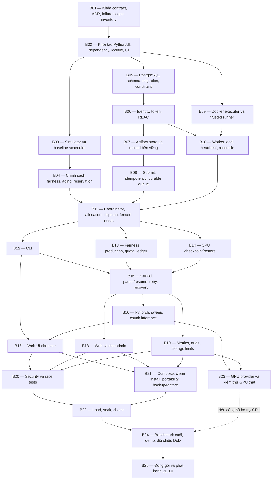

# ROADMAP — nexa / PBL4

Đây là bản đồ công việc của dự án theo [PLAN.md](PLAN.md). Tên các chặng giữ nguyên như bản đồ đã trao đổi; phần giải thích dùng lời dễ hiểu. Nếu có điểm khác nhau, PLAN là tài liệu được ưu tiên.

Mỗi mã `Bxx` là một công việc, không phải số thứ tự bắt buộc làm liên tục. B1 và B2 trong tên task tương ứng B01 và B02. Mũi tên nghĩa là phải hoàn thành việc phía trước mới bắt đầu việc phía sau. Nếu có nhiều mũi tên đi vào một việc, phải hoàn thành **tất cả** các việc đó, trừ nhánh GPU có ghi điều kiện riêng.

Hãy hình dung dự án như xây một ngôi nhà:

- B01 là bản thiết kế và luật sử dụng.
- B02 là dựng khung nhà và chuẩn bị dụng cụ.
- Các chặng sau lần lượt xây bộ phận chia việc, nơi lưu dữ liệu, bộ phận thực hiện công việc, giao diện và phần kiểm tra.

## Trạng thái ghi nhận ngày 20/09/2026

- **B01 đã được Task Review duyệt.**
- **B02 đã hoàn thành và được Task Review duyệt.** B02 hiện có bộ khung Python, giao diện web mẫu, lockfile cho Python/UI, kiểm tra cấu hình, kiểm thử tự động và CI chỉ đọc. Các mục Review trước đây đã được xử lý và kiểm chứng.
- **B03 đã hoàn thành và được focused Task Review duyệt.** B03 hiện có simulator virtual-time deterministic, năm baseline FIFO/RR/WRR/DRR/DRF, raw evidence và report tái lập. Đây chỉ là evidence lớp D, không phải scheduler sản phẩm hoặc runtime acceptance evidence.
- **B04 đã hoàn thành và được Task Review duyệt ngày 19/09/2026.** Đã có thuật toán chia tài nguyên theo quyền lợi từng nhóm và thời gian giữ tài nguyên, tăng ưu tiên cho việc chờ lâu và dành chỗ cho việc lớn. Thuật toán đã được kiểm tra trong mô phỏng với năm bộ dữ liệu sinh từ seed cố định; phần kết nối cơ sở dữ liệu và vận hành thật thuộc các chặng sau.
- **B05 đã hoàn thành và được Task Review duyệt, theo xác nhận của user ngày 20/09/2026.** Đã có cấu trúc lưu dữ liệu PostgreSQL, migration để thay đổi cấu trúc có kiểm soát, các quy tắc chặn dữ liệu sai hoặc trùng, công cụ xử lý giao dịch và kiểm thử tích hợp trên PostgreSQL 17. B06 đã đủ điều kiện bắt đầu; phần vận hành và phục hồi công việc thật thuộc các chặng sau.
- **B06 đã hoàn thành và được Task Review duyệt, theo xác nhận của user ngày 20/09/2026.** API `/v1` đã có identity, browser session/CSRF, CLI token, SYSTEM_ADMIN, tenant/membership, policy versioned, admin/worker bootstrap và audit. B07 đủ điều kiện bắt đầu; workload, scheduler, recovery, UI và release vẫn thuộc các chặng sau.
- **B07 đã hoàn thành và được Task Review duyệt, theo xác nhận của user ngày 20/09/2026.** Đã có filesystem ArtifactStore, upload bounded, checksum/size/media validation, PostgreSQL tenant reservation counters, idempotency replay, ownership checks và list/metadata/range download. B08 đủ điều kiện bắt đầu; Linux portability, worker attempt uploads, checkpoint/restore, operational GC/metrics, load và release gates vẫn thuộc các chặng sau.
- **B08 đã hoàn thành và được Task Review duyệt, theo xác nhận của user ngày 20/09/2026.** Đã nhận và lưu công việc vào PostgreSQL, kiểm tra quyền/tệp/mẫu việc và giới hạn tiếp nhận; gửi lại cùng yêu cầu không tạo công việc trùng. Có API xem công việc, phiên xử lý và lịch sử sự kiện. Kiểm thử đã đối chiếu công việc được nhận khi nhiều yêu cầu đến đồng thời và khi API sập sau khi lưu nhưng chưa trả lời; khởi động API mới vẫn tìm và trả lại đúng công việc. Phần chạy việc, chia tài nguyên thật, phục hồi quá trình tính toán, UI, tải lớn và release vẫn thuộc các chặng sau.
- Các chặng B09–B25 chưa được coi là hoàn thành.

Nguồn ghi nhận: phản hồi duyệt cuối của Task **Review** cho B01–B04, phản hồi hoàn tất của Task **B2 - Bootstrap**, [báo cáo B02](docs/evidence/B02-bootstrap.md), [báo cáo B03](docs/evidence/B03-simulator.md), [báo cáo triển khai B04](docs/evidence/B04-fairness.md), [evidence triển khai B05](docs/evidence/B05-postgresql.md), [evidence triển khai B06](docs/evidence/B06-identity-token-rbac.md), [evidence triển khai B07](docs/evidence/B07-artifact-store.md), [B08 submit evidence](docs/evidence/B08-submit-durable-queue.md) và các xác nhận của user ngày 20/09/2026 rằng Task **Review** đã duyệt B05, B06, B07 và B08. Các báo cáo triển khai được lập trước quyết định duyệt có thể còn ghi chờ review; trạng thái B05–B08 ở đây đã được cập nhật theo xác nhận mới nhất của user.

Chặng tiếp theo là **B09 — Docker executor và trusted runner**, đã đủ điều kiện từ B02. Sau B09 có thể thực hiện B10 vì B06 đã hoàn thành. B11 đã đủ phần B04 và B08, còn chờ B10 để nối luồng từ gửi việc đến nhận kết quả CPU.

Đây là ảnh chụp tiến độ tại thời điểm viết, không phải thông báo tiến độ tự động.

## Bản đồ phụ thuộc

B23 chỉ bắt buộc trước B24 nếu muốn công bố hỗ trợ GPU. Khi chưa kiểm chứng GPU thật, vẫn có thể hoàn tất bản chạy CPU nếu đạt mọi điều kiện còn lại, nhưng phải ghi rõ GPU chưa được kiểm chứng.

## Các chặng công việc

| Mã | Tên lộ trình | Làm gì bằng lời dễ hiểu | Cần chờ |
|---|---|---|---|
| B01 | Khóa contract, ADR, failure scope, inventory | Viết rõ hệ thống phải làm gì, các bộ phận trao đổi ra sao, chịu được loại sự cố nào và có máy móc, nhân lực gì để thực hiện. | Không |
| B02 | Khởi tạo Python/UI, dependency, lockfile, CI | Chuẩn bị bộ khung Python và giao diện web, khóa phiên bản thư viện, tạo kiểm tra tự động và quy tắc cấu hình an toàn. | B01 |
| B03 | Simulator và baseline scheduler | Tạo mô hình chạy thử và các cách chia việc để làm mốc so sánh. Ví dụ: xem điều gì xảy ra khi ai đến trước được chạy trước. | B02 |
| B04 | Chính sách fairness, aging, reservation | Viết cách chia đã chọn cho dự án, thử trong mô hình và kiểm tra rằng công việc cần nhiều tài nguyên không bị bỏ quên khi việc nhỏ liên tục đến. | B03 |
| B05 | PostgreSQL schema, migration, constraint | Xây nơi lưu người dùng, công việc, giới hạn được phép và lịch sử. Đặt quy tắc để không lưu dữ liệu sai hoặc trùng trái phép. | B02 |
| B06 | Identity, token, RBAC | Tạo cách nhận biết người dùng và quy định ai được xem hoặc làm việc gì, đồng thời quản lý các giới hạn được phép. | B05 |
| B07 | Artifact store và upload bền vững | Đã hoàn thành và được duyệt: lưu tệp an toàn, upload có giới hạn, kiểm tra checksum, commit bền vững, giữ quota theo tenant, chống gửi trùng và cung cấp API tệp. | B06 |
| B08 | Submit, idempotency, durable queue | Đã hoàn thành và được duyệt: lưu yêu cầu vào hàng chờ bền vững, gửi lại cùng yêu cầu không tạo việc trùng; xem trạng thái và lịch sử đúng quyền; từ chối rõ ràng khi hết chỗ hoặc vượt giới hạn. | B07 |
| B09 | Docker executor và trusted runner | Nhận biết tài nguyên của máy và xây bộ phận chạy công việc trong khu vực có giới hạn sức xử lý, bộ nhớ, thời gian và tệp tạm. | B02 |
| B10 | Worker local, heartbeat, reconcile | Tạo chương trình chạy ngay trên máy chủ để nhận việc, báo mình còn hoạt động và kiểm tra, dọn các lần chạy cũ sau khởi động lại. | B06, B09 |
| B11 | Coordinator, allocation, dispatch, fenced result | Nối các bộ phận để nhận yêu cầu, chọn việc, cấp tài nguyên, chạy và nhận kết quả. Chặn kết quả đến từ lần chạy đã mất quyền. | B04, B08, B10 |
| B12 | CLI | Tạo cách điều khiển bằng cửa sổ gõ lệnh: tải tệp lên, gửi việc, xem tình trạng, lấy kết quả và quản trị. Các lệnh tạm dừng/chạy tiếp được bổ sung ở B15. | B11 |
| B13 | Fairness production, quota, ledger | Đưa cách chia công bằng vào hệ thống thật, giữ đúng giới hạn mỗi nhóm và ghi lại tài nguyên đã cấp cùng thời gian giữ. Khởi động lại không làm mất sổ ghi này. | B11 |
| B14 | CPU checkpoint/restore | Cho công việc lưu tiến độ giữa chừng, chạy tiếp từ lần lưu hợp lệ gần nhất và kiểm tra kết quả giống khi chạy không bị ngắt. | B11 |
| B15 | Cancel, pause/resume, retry, recovery | Hoàn thiện hủy, tạm dừng, chạy tiếp và thử lại. Khi gặp lỗi, khôi phục từ điểm lưu; chỉ cấp lại tài nguyên khi lần chạy cũ đã thực sự dừng. | B12, B13, B14 |
| B16 | PyTorch, sweep, chunk inference | Thêm các mẫu việc AI được cho phép: dạy một mô hình nhỏ, thử nhiều bộ cài đặt và dùng mô hình xử lý dữ liệu từng phần. Kiểm tra chúng lưu tiến độ và chạy tiếp đúng. | B15 |
| B17 | Web UI cho user | Tạo trang web để người dùng đăng nhập, gửi việc, xem tiến độ, hủy hoặc tạm dừng/chạy tiếp và tải kết quả. | B12, B16 |
| B18 | Web UI cho admin | Tạo trang quản trị để quản lý người dùng, giới hạn được phép, máy chạy, hàng chờ; xem cách chia tài nguyên, sự cố và lịch sử thao tác. | B15 |
| B19 | Metrics, audit, storage limits | Ghi số liệu và nhật ký cần thiết, giới hạn dung lượng và giúp biết hệ thống đang khỏe hay gặp vấn đề. | B15 |
| B20 | Security và race tests | Kiểm tra người dùng không xem dữ liệu trái quyền và không vượt giới hạn. Thử các tình huống như hủy công việc đúng lúc kết quả vừa gửi về để tìm và sửa lỗi. | B17, B18, B19 |
| B21 | Compose, clean install, portability, backup/restore | Cài cùng bản phần mềm trên hai cấu hình Linux, mỗi máy hoạt động độc lập. Kiểm tra sao lưu, khôi phục và chuyển sang máy khác có dừng hệ thống. | B17, B18, B19 |
| B22 | Load, soak, chaos | Đo khi có nhiều người và nhiều việc, chạy liên tục ít nhất 8 giờ, cố ý tạo sự cố và kiểm tra không mất việc đã nhận hay công nhận kết quả trùng. | B20, B21 |
| B23 | GPU provider và kiểm thử GPU thật | Nhận biết và cấp GPU thật cho công việc. Kiểm tra không cấp trùng thiết bị, mỗi công việc chỉ thấy thiết bị được giao và việc AI có thể chạy tiếp sau lỗi. | B16, B19 |
| B24 | Benchmark cuối, demo, đối chiếu DoD | Chạy lại các bài đo cuối, chuẩn bị demo và đối chiếu từng điều kiện hoàn thành của dự án. | B22; thêm B23 nếu công bố GPU |
| B25 | Đóng gói và phát hành v1.0.0 | Đóng gói bản chính thức, tạo hướng dẫn cài đặt và phát hành một bản `v1.0.0`. | B24 |

## Những chặng có thể làm song song

Sau khi B02 xong, ba nhánh có thể bắt đầu riêng:

- **B03:** mô phỏng cách chia tài nguyên.
- **B05:** thiết kế nơi lưu dữ liệu.
- **B09:** chuẩn bị bộ phận chạy công việc có giới hạn tài nguyên.

Sau B11, có thể làm cùng lúc:

- **B12:** điều khiển bằng cửa sổ lệnh.
- **B13:** chia tài nguyên công bằng trong hệ thống thật.
- **B14:** lưu tiến độ và chạy tiếp công việc CPU.

Sau B15, có thể làm cùng lúc:

- **B16:** các mẫu việc AI.
- **B18:** giao diện người quản trị.
- **B19:** số liệu và giới hạn vận hành.

Khi B17, B18 và B19 đều xong, có thể làm B20 và B21 cùng lúc. B23 có thể làm cùng các chặng khác khi B16 và B19 đã xong và có GPU thật để kiểm chứng.

Chỉ làm song song khi đủ mọi việc cần chờ và các phần sửa không xung đột. Các nhóm phải giữ đúng thỏa thuận đã khóa ở B01. Nếu chỉ làm một mình, vẫn có thể đi lần lượt B01 → B02 → … → B25, với B23 theo điều kiện GPU đã nêu.

## Các mốc dễ hiểu

| Mốc | Sau khi đạt được | Có thể trình bày gì |
|---|---|---|
| B01 | Có bản thiết kế và luật hoạt động thống nhất | Giải thích cách các phần trao đổi, chia tài nguyên và phục hồi sau lỗi |
| B02 | Có bộ khung phát triển và kiểm tra tự động | Chạy kiểm tra mã, tạo bản giao diện mẫu; chưa gửi và xử lý việc thật |
| B04 | Có cách chia tài nguyên chạy được trong mô phỏng | Cho xem nhóm nào được ưu tiên và vì sao; chưa chứng minh sức chịu tải máy chủ thật |
| B11 | Có đường đi cơ bản từ gửi việc đến nhận kết quả CPU | Chạy một công việc CPU trong hệ thống |
| B15 | Có hủy, tạm dừng và khôi phục | Cho thấy công việc CPU tiếp tục từ lần lưu trước khi bị lỗi; việc AI được thêm ở B16 |
| B17, B18, B19 đều xong | Có giao diện người dùng/quản trị và số liệu vận hành | Trình diễn sản phẩm qua trình duyệt |
| B22 và B24 xong; B23 nếu công bố GPU | Có bằng chứng chịu tải, xử lý sự cố và kịch bản trình diễn | Trình bày kết quả đo và giới hạn thật |
| B25 | Có sản phẩm phát hành | Cài đặt và sử dụng bản `v1.0.0` |

## Giải thích thuật ngữ

Có thể tra phần này khi gặp một từ lạ; không cần học thuộc trước khi đọc lộ trình.

### Những khái niệm chung

- **Server (máy chủ):** máy tính nhận và xử lý yêu cầu của nhiều người. Dự án này quản lý một máy chủ trong mỗi lần cài đặt; có thể cài độc lập trên các máy khác nhau.
- **Resource (tài nguyên), CPU, RAM, GPU:** những thứ máy cần để làm việc. CPU là bộ phận tính toán chính; RAM là bộ nhớ làm việc tạm thời; GPU là bộ phận tính toán chuyên dụng, thường giúp tăng tốc công việc AI.
- **AI:** trí tuệ nhân tạo; trong dự án này là các công việc dạy mô hình học từ dữ liệu hoặc dùng mô hình đã học để xử lý dữ liệu mới.
- **Job / workload:** công việc được gửi cho máy xử lý, chẳng hạn dạy một mô hình nhận biết hình ảnh.
- **Python / Linux:** Python là ngôn ngữ dùng để viết phần xử lý chính; Linux là hệ điều hành của máy chủ chạy sản phẩm.
- **uv / Node.js / LTS:** uv là công cụ quản lý thư viện Python; Node.js là môi trường chạy các công cụ phát triển và tạo bản giao diện web; LTS chỉ phiên bản được hỗ trợ trong thời gian dài.
- **Cổng kết nối:** số chỉ nơi một dịch vụ nhận kết nối trên máy, ví dụ cơ sở dữ liệu PostgreSQL thường dùng cổng `5432`.
- **UI / Web UI:** giao diện có nút bấm và màn hình; Web UI là giao diện mở bằng trình duyệt.
- **User / admin:** người dùng thông thường / người quản trị hệ thống.
- **CLI:** cách điều khiển bằng cách gõ lệnh thay vì bấm nút.

### Thiết kế và chuẩn bị

- **Contract:** bản thỏa thuận chính xác về dữ liệu, hành vi và cách các bộ phận trao đổi.
- **ADR:** tài liệu ghi một quyết định thiết kế quan trọng, lý do chọn và điều phải đánh đổi.
- **Failure scope:** phạm vi sự cố cam kết xử lý. Ví dụ: chương trình bị tắt hoặc máy khởi động lại khi dữ liệu trên ổ đĩa còn nguyên; không bao gồm mất ổ đĩa.
- **Inventory:** danh sách máy móc, cấu hình và điều kiện sẵn có để xây dựng, chạy và kiểm tra dự án.
- **Bootstrap:** dựng bộ khung ban đầu để bắt đầu phát triển.
- **Dependency / lockfile:** dependency là thư viện hoặc công việc phải có trước; lockfile ghi chính xác phiên bản thư viện cần cài để các máy dùng cùng phiên bản.
- **CI:** hệ thống tự chạy các bài kiểm tra mã khi thay đổi được gửi lên nơi lưu mã chung.

### Chia tài nguyên và lưu dữ liệu

- **Simulator / baseline:** simulator là mô hình tính thử cách hệ thống hoạt động, chưa chứng minh hiệu năng máy chủ thật; baseline là cách làm được chọn làm mốc so sánh.
- **Scheduler / fairness:** scheduler là bộ phận chọn việc nào được chạy; fairness là chia cơ hội sử dụng máy theo quyền lợi của từng nhóm, có tính đến tài nguyên được cấp và thời gian giữ chúng.
- **Aging / reservation:** aging giúp công việc chờ lâu được xét ưu tiên trong nhóm của mình; reservation tạm dành phần tài nguyên cần thiết cho một việc đủ điều kiện, tránh việc nhỏ liên tục lấy hết chỗ. Cả hai vẫn phải tuân theo giới hạn và cách chọn nhóm công bằng.
- **PostgreSQL / schema:** PostgreSQL là phần mềm lưu dữ liệu có tổ chức; schema là bản quy định những bảng và loại thông tin được lưu.
- **Migration / constraint:** migration là cách cập nhật cấu trúc dữ liệu có kiểm soát; constraint là quy tắc nơi lưu dữ liệu tự kiểm tra để chặn dữ liệu sai, như hai kết quả cuối cho cùng một công việc.
- **Identity / token / RBAC:** identity xác định ai đang sử dụng; token giống thẻ truy cập có giới hạn quyền và thời hạn; RBAC phân quyền theo vai trò, như người dùng hay người quản trị.
- **Artifact / artifact store / upload:** artifact là tệp công việc sử dụng hoặc tạo ra; artifact store là nơi quản lý các tệp đó; upload là tải tệp lên hệ thống.
- **Submit / durable queue:** submit là gửi công việc; durable queue là hàng chờ được lưu bền vững, còn giữ được sau khi chương trình khởi động lại.
- **Idempotency:** gửi lại yêu cầu với cùng mã chống trùng và cùng nội dung thì hệ thống nhận ra yêu cầu cũ, không tạo thêm một công việc nữa.
- **Quota / ledger / production:** quota là giới hạn mỗi nhóm được phép dùng; ledger là sổ ghi tài nguyên đã cấp và thời gian giữ; production ở B13 nghĩa là đưa cách chia vào hệ thống chạy thật.

### Chạy công việc và phục hồi

- **Docker / container:** Docker giúp chạy công việc trong các khu vực tách biệt gọi là container, với giới hạn tài nguyên và quyền truy cập được thiết lập.
- **Executor / trusted runner:** executor là bộ phận tạo, dừng và kiểm tra lần chạy; trusted runner là chương trình do dự án kiểm soát, giám sát công việc bên trong và buộc nó dừng khi hết thời hạn được phép chạy.
- **Worker / local / heartbeat / reconcile:** worker là chương trình nhận và chạy việc; local nghĩa là ngay trên máy chủ đó; heartbeat là tín hiệu “tôi vẫn đang hoạt động”; reconcile là đối chiếu dữ liệu đã lưu với những gì thực sự đang chạy để xử lý chênh lệch.
- **Coordinator / allocation / dispatch:** coordinator là bộ phận điều phối; allocation là phần tài nguyên cấp cho một lần chạy; dispatch là giao công việc đã chọn cho bộ phận thực hiện.
- **Fenced result:** chỉ công nhận kết quả từ lần chạy còn được cấp quyền; chặn kết quả gửi muộn từ lần chạy cũ đã mất quyền.
- **Checkpoint / restore / recovery:** checkpoint là điểm lưu tiến độ giữa chừng; restore là nạp lại điểm lưu; recovery là quá trình đưa công việc trở lại hoạt động sau sự cố. Công việc phải được thiết kế hỗ trợ lưu tiến độ, không phải chương trình bất kỳ đều tự chạy tiếp được.
- **Cancel / pause / resume / retry:** lần lượt là hủy, tạm dừng, chạy tiếp và thử lại. Chạy tiếp giữ cùng công việc; thử lại tạo công việc mới có liên kết về công việc cũ.
- **PyTorch / sweep / chunk inference:** PyTorch là bộ công cụ xây và chạy mô hình AI; sweep là thử nhiều bộ cài đặt để so sánh; chunk inference là dùng mô hình xử lý dữ liệu theo từng phần nhỏ để lưu được tiến độ.
- **GPU provider:** phần kết nối giúp hệ thống nhận biết và cấp đúng GPU cho công việc.

### Kiểm tra, cài đặt và phát hành

- **Metrics / audit / storage limits:** metrics là số liệu theo dõi tình trạng; audit là lịch sử ai đã làm gì; storage limits là giới hạn dung lượng được phép lưu.
- **Security / race tests:** kiểm tra bảo vệ dữ liệu và quyền truy cập / kiểm tra khi nhiều thao tác xảy ra gần như cùng lúc, ví dụ hủy công việc trong lúc kết quả vừa gửi về.
- **Compose / clean install:** Compose là công cụ khởi chạy các phần của hệ thống theo cấu hình chung; clean install là thử cài từ đầu trên máy chưa có dự án.
- **Portability / backup:** portability là khả năng cài cùng sản phẩm trên các máy có cấu hình khác nhau; backup là sao lưu dữ liệu để có thể khôi phục. Khôi phục bản sao lưu toàn hệ thống khác với chạy tiếp một công việc từ điểm lưu tiến độ.
- **Load / soak / chaos:** lần lượt là thử nhiều yêu cầu, chạy liên tục trong thời gian dài và cố ý tạo sự cố để kiểm tra khả năng chịu đựng, phục hồi.
- **Benchmark / demo:** benchmark là bài đo có điều kiện rõ ràng để so sánh kết quả; demo là trình diễn sản phẩm hoạt động.
- **DoD (Definition of Done):** danh sách điều kiện cần đạt để xác nhận dự án hoàn thành.
- **Release / v1.0.0:** release là bản sản phẩm đóng gói, phát hành cho người khác cài; `v1.0.0` là tên phiên bản chính thức dự án cần bàn giao.
