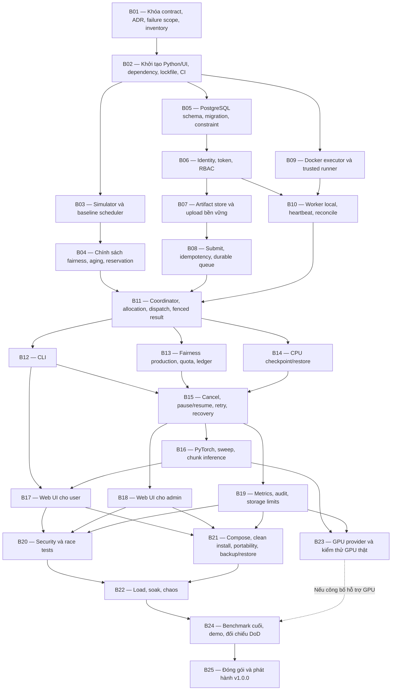

# ROADMAP — nexa / PBL4

Đây là bản đồ công việc của dự án theo [PLAN.md](PLAN.md). Tên các chặng giữ nguyên như bản đồ đã trao đổi; phần giải thích dùng lời dễ hiểu. Nếu có điểm khác nhau, PLAN là tài liệu được ưu tiên.

Mỗi mã `Bxx` là một công việc, không phải số thứ tự bắt buộc làm liên tục. B1 và B2 trong tên task tương ứng B01 và B02. Mũi tên nghĩa là phải hoàn thành việc phía trước mới bắt đầu việc phía sau. Nếu có nhiều mũi tên đi vào một việc, phải hoàn thành **tất cả** các việc đó, trừ nhánh GPU có ghi điều kiện riêng.

Hãy hình dung dự án như xây một ngôi nhà:

- B01 là bản thiết kế và luật sử dụng.
- B02 là dựng khung nhà và chuẩn bị dụng cụ.
- Các chặng sau lần lượt xây bộ phận chia việc, nơi lưu dữ liệu, bộ phận thực hiện công việc, giao diện và phần kiểm tra.

## Trạng thái ghi nhận ngày 30/09/2026

- **B01 đã được Task Review duyệt.**
- **B02 đã hoàn thành và được Task Review duyệt.** B02 hiện có bộ khung Python, giao diện web mẫu, lockfile cho Python/UI, kiểm tra cấu hình, kiểm thử tự động và CI chỉ đọc. Các mục Review trước đây đã được xử lý và kiểm chứng.
- **B03 đã hoàn thành và được focused Task Review duyệt.** B03 hiện có simulator virtual-time deterministic, năm baseline FIFO/RR/WRR/DRR/DRF, raw evidence và report tái lập. Đây chỉ là evidence lớp D, không phải scheduler sản phẩm hoặc runtime acceptance evidence.
- **B04 đã hoàn thành và được Task Review duyệt ngày 19/09/2026.** Đã có thuật toán chia tài nguyên theo quyền lợi từng nhóm và thời gian giữ tài nguyên, tăng ưu tiên cho việc chờ lâu và dành chỗ cho việc lớn. Thuật toán đã được kiểm tra trong mô phỏng với năm bộ dữ liệu sinh từ seed cố định; phần kết nối cơ sở dữ liệu và vận hành thật thuộc các chặng sau.
- **B05 đã hoàn thành và được Task Review duyệt, theo xác nhận của user ngày 20/09/2026.** Đã có cấu trúc lưu dữ liệu PostgreSQL, migration để thay đổi cấu trúc có kiểm soát, các quy tắc chặn dữ liệu sai hoặc trùng, công cụ xử lý giao dịch và kiểm thử tích hợp trên PostgreSQL 17. B06 đã đủ điều kiện bắt đầu; phần vận hành và phục hồi công việc thật thuộc các chặng sau.
- **B06 đã hoàn thành và được Task Review duyệt, theo xác nhận của user ngày 20/09/2026.** API `/v1` đã có identity, browser session/CSRF, CLI token, SYSTEM_ADMIN, tenant/membership, policy versioned, admin/worker bootstrap và audit. B07 đủ điều kiện bắt đầu; workload, scheduler, recovery, UI và release vẫn thuộc các chặng sau.
- **B07 đã hoàn thành và được Task Review duyệt, theo xác nhận của user ngày 20/09/2026.** Đã có filesystem ArtifactStore, upload bounded, checksum/size/media validation, PostgreSQL tenant reservation counters, idempotency replay, ownership checks và list/metadata/range download. B08 đủ điều kiện bắt đầu; Linux portability, worker attempt uploads, checkpoint/restore, operational GC/metrics, load và release gates vẫn thuộc các chặng sau.
- **B08 đã hoàn thành và được Task Review duyệt, theo xác nhận của user ngày 20/09/2026.** Đã nhận và lưu công việc vào PostgreSQL, kiểm tra quyền/tệp/mẫu việc và giới hạn tiếp nhận; gửi lại cùng yêu cầu không tạo công việc trùng. Có API xem công việc, phiên xử lý và lịch sử sự kiện. Kiểm thử đã đối chiếu công việc được nhận khi nhiều yêu cầu đến đồng thời và khi API sập sau khi lưu nhưng chưa trả lời; khởi động API mới vẫn tìm và trả lại đúng công việc. Phần chạy việc, chia tài nguyên thật, phục hồi quá trình tính toán, UI, tải lớn và release vẫn thuộc các chặng sau.
- **B09 đã hoàn thành và được Task Review duyệt, theo xác nhận của user ngày 21/09/2026.** Đã có bộ phận nhận biết tài nguyên và chạy công việc CPU trong container có giới hạn sức xử lý, bộ nhớ, số tiến trình, tệp tạm và nhật ký. Runner giám sát riêng để dừng việc khi hết quyền hoặc quá thời gian; executor giữ đúng định danh container khi khởi chạy, dừng và dọn dẹp. Evidence gồm kiểm thử tự động và mười một tình huống container thật trên Docker Desktop Linux VM. Nghiệm thu triển khai Linux, hai máy khác nhau, GPU và release vẫn thuộc các chặng sau.
- **B10 đã hoàn thành và được Task Review duyệt, theo xác nhận của user ngày 22/09/2026.** Đã có chương trình chạy trên máy chủ để báo còn hoạt động, kiểm tra các lần chạy cũ và chỉ sẵn sàng nhận việc sau khi đối soát an toàn. Khi chương trình khởi động lại, nó có thể tiếp quản lần chạy còn quyền hoặc dọn dẹp đúng định danh; giữ lại thông tin chưa được xác nhận để xử lý tiếp. Đã kiểm thử tình huống tắt đột ngột rồi khởi động lại với runner thật trên Docker Desktop Linux VM. Luồng đầy đủ từ gửi việc đến nhận kết quả, phục hồi từ điểm lưu, triển khai Linux, hai máy khác nhau, GPU và release vẫn thuộc các chặng sau.
- **B11 đã hoàn thành và được Task Review duyệt, theo xác nhận của user ngày 24/09/2026.** Đã nối hàng chờ với coordinator, cấp tài nguyên, giao việc cho worker, chạy workload CPU, nhận kết quả có kiểm tra quyền và trả tài nguyên sau cleanup đúng định danh. Luồng upload → submit → dispatch → runner → tải kết quả cho hai tenant, mất response sau commit và restart trước cleanup đã được kiểm thử trên Docker Desktop Linux VM. Checkpoint/recovery đầy đủ, triển khai bare Linux, hai máy khác nhau, GPU và release vẫn thuộc các chặng sau.
- **B12 đã hoàn thành và được Task Review duyệt, theo xác nhận của user ngày 25/09/2026.** Đã có CLI `nexa` để cấu hình kết nối, quản lý token, tải tệp lên, gửi việc, xem công việc/phiên xử lý/sự kiện, tải kết quả và quản trị danh tính/giới hạn/lịch sử thao tác qua API chung. Đã kiểm thử quyền của hai nhóm người dùng, gửi lại yêu cầu khi mất phản hồi và luồng CLI → chạy CPU → tải kết quả trên Docker Desktop Linux VM. Chỉ đăng ký các lệnh có backend tương ứng; phần còn thiếu được ghi tại [CLI guide](docs/cli.md) và [B12 evidence](docs/evidence/B12-cli.md). Phê duyệt này không thay nghiệm thu đầy đủ của sản phẩm; job controls thuộc B15, các chức năng và gate còn lại tiếp tục theo PLAN.
- **B13 đã hoàn thành và được Task Review duyệt, theo xác nhận của user ngày 26/09/2026.** Cách chia tài nguyên công bằng đã chạy trong coordinator thật: mỗi nhóm không vượt giới hạn được phép, việc chờ lâu được tăng ưu tiên, việc lớn được giữ chỗ, và sổ ghi tài nguyên đang giữ được cập nhật tối đa mỗi 250 ms qua một luồng riêng, khởi động lại không làm mất hay tính trùng. Lỗi của Task Review vòng 1 (B13-R13: ở giới hạn mặc định, mỗi lần cấp/trả tài nguyên làm hệ thống xét lại cả hàng chờ nên giao việc rất chậm) đã được sửa và đóng ở vòng 2 sau khi Task Review chạy lại độc lập. Kiểm thử trên PostgreSQL 17 (Docker Desktop Linux VM): 100.000 công việc nộp qua API trong một lần chạy, hàng chờ 100.000 việc chỉ đọc qua index, khoảng cách ghi sổ tối đa 498,1 ms trong hai lần chạy 720 giây, chỉ số công bằng Jain tối thiểu 0,9994 qua ba lần chạy ở giới hạn mặc định, việc lớn được giữ chỗ sau 121 giây và lỗi DB tiêm vào có rollback/catch-up. **Còn mở B13-R12** (lỗi gốc từ B05: lệnh thống kê và khôi phục bảng sổ công bằng của PostgreSQL bị lỗi vì các hàm Decimal gọi nhau không ghi rõ schema); không ảnh hưởng gate của B13, đang chờ user quyết định cách xử lý và liên quan trực tiếp đến sao lưu/khôi phục ở B21. Phê duyệt này không thay nghiệm thu tải B22, bare Linux, GPU hay release. Xem [B13 evidence](docs/evidence/B13-production-fairness.md).
- **B14 đã hoàn thành và được Task Review duyệt, theo xác nhận của user ngày 26/09/2026.** Công việc CPU giờ tự lưu tiến độ định kỳ. Khi container bị tắt đột ngột, hệ thống chờ một khoảng ngắn, xếp việc vào hàng chờ lại và chạy tiếp từ lần lưu hợp lệ mới nhất. Mọi lần lưu đều được kiểm tra quyền, nguồn gốc và tính tương thích. Lần lưu bị hỏng được đánh dấu để không bao giờ dùng lại, và hệ thống chuyển sang lần lưu cũ hơn. Khi không còn lần lưu hợp lệ, việc được phép chạy lại từ đầu thì chạy lại và có ghi sự kiện; việc không được phép thì dừng hẳn và báo lý do. Người dùng xem danh sách lần lưu qua API và lệnh `nexa job checkpoints`. Có sáu tình huống kiểm thử với container thật trên Docker Desktop Linux VM: tắt container ở nhiều thời điểm, làm hỏng lần lưu mới nhất, làm hỏng tất cả lần lưu và tắt worker khi đang lưu dở. Mọi kết quả đều giống từng byte với lần chạy không bị ngắt. Task Review vòng 1 không duyệt vì còn năm lỗi chặn. Vòng 2 đã sửa hết, và Task Review chạy lại độc lập kiểm thử PostgreSQL lẫn Docker trước khi duyệt. Còn một số lỗi nhỏ không chặn (B14-R03/R04/R05/R10/R11 và hai ghi chú), liệt kê trong [B14 evidence](docs/evidence/B14-cpu-checkpoint-restore.md) và mục Bàn giao B14 bên dưới. Phê duyệt này không thay phần phục hồi đầy đủ của B15, các workload AI của B16, việc dọn dữ liệu cũ của B19, tải B22, bare Linux, GPU hay release.
- **B15 đã hoàn thành và được Task Review duyệt, theo xác nhận của user ngày 27/09/2026.** Người dùng giờ có thể hủy, tạm dừng, chạy tiếp và thử lại công việc qua API và lệnh `nexa job cancel|pause|resume|retry`. Tạm dừng chỉ hoàn tất khi tiến độ đã được lưu và container cũ đã thật sự dừng. Chạy tiếp không tốn lượt thử lại. Thử lại thủ công tạo một công việc mới, có thể dùng lần lưu của công việc cũ. Khi worker mất liên lạc quá thời hạn, coordinator tự thu hồi quyền của lần chạy cũ nhưng vẫn giữ tài nguyên cho đến khi có bằng chứng container đã dừng, rồi mới chạy lại từ lần lưu gần nhất. Admin có thể ngừng giao việc mới cho một worker (drain), tắt hẳn worker (disable) và bật lại khi worker đã khỏe (enable). Các tình huống kiểm thử với container thật trên Docker Desktop Linux VM gồm: tạm dừng rồi chạy tiếp, hủy, tắt worker quá thời hạn, sập giữa lúc tạm dừng, drain/disable/enable, thử lại thủ công, quá giờ, mất mạng và khởi động lại cả hệ thống. Kết quả sau phục hồi giống từng byte với lần chạy không bị ngắt. Task Review vòng 1 không duyệt; vòng 2 đã sửa các lỗi chặn và chạy lại kiểm thử trước khi duyệt. B15 cũng sửa bốn lỗi nhỏ còn lại của B14 (B14-R03/R05/R10/R11). Còn một số điểm không chặn (B15-R11/R32/R33/R39, bốn diễn giải contract B15-R02/R05/R06/R34, B14-R04 và B13-R12), liệt kê trong [B15 evidence](docs/evidence/B15-control-recovery.md) và mục Bàn giao B15 bên dưới. Phê duyệt này không thay các workload AI của B16, Web UI của B17/B18, số liệu và dọn dữ liệu của B19, kiểm thử race/bảo mật của B20, khởi động lại máy và tải lớn của B22, bare Linux, GPU hay release.
- **B16 đã hoàn thành và được Task Review duyệt, theo xác nhận của user ngày 28/09/2026.** Admin đăng ký được các mẫu việc AI được cho phép bằng một lệnh bảo trì, và người dùng xem danh sách mẫu qua API và lệnh `nexa template list|show`. Người dùng dạy được một mô hình nhỏ trên CPU, thử nhiều bộ cài đặt cùng lúc (tối đa 100 bộ, mỗi bộ là một công việc riêng, qua lệnh `nexa sweep submit|show`) và dùng mô hình xử lý dữ liệu theo từng phần. Mỗi bộ cài đặt được kiểm giới hạn riêng như một công việc bình thường; gửi lại cùng yêu cầu trả đúng kết quả cũ, không tạo việc trùng. Việc dạy mô hình lưu cả mô hình, trạng thái tối ưu, bộ sinh số ngẫu nhiên và vị trí đang đọc dữ liệu, nên chạy tiếp được sau khi container bị tắt đột ngột hoặc lần lưu mới nhất bị hỏng. Kết quả sau phục hồi nằm trong ngưỡng sai số đã khóa trước khi đo, và thực tế giống hệt lần chạy không bị ngắt. Việc xử lý theo từng phần giữ lại các phần đã xong, chỉ tính phần còn lại và không tạo phần trùng. Dữ liệu vượt giới hạn hoặc hỏng dừng với lỗi đầu vào, việc vượt giới hạn bộ nhớ dừng với lỗi OOM; cả hai không thử lại. Các tình huống container thật chạy trên VPS1 (một máy ảo Linux thật trên AWS, không có GPU); trên Mac chỉ chạy lại các kiểm thử CPU cũ với image mới. Task Review vòng 1 không duyệt vì ba lỗi chặn; vòng 2 đã sửa hết, và Task Review chạy lại độc lập kiểm thử tự động và PostgreSQL. Các kiểm thử container trên VPS1 được duyệt dựa trên evidence của Task Code. Còn mở, không chặn: B16-R21 (sau khi quay về lần lưu cũ hơn, việc xử lý từng phần bị dừng với lỗi chưa thống nhất, chờ quyết định), B16-R29 (một test cũ của B09 fail trên VPS1 vì cách so người dùng) và một câu tài liệu chưa chính xác về lỗi đầu vào. Phê duyệt này không thay Web UI của B17/B18, số liệu và dọn dữ liệu của B19, kiểm thử race/bảo mật của B20, chuyển máy và sao lưu của B21, tải lớn của B22, GPU của B23 hay release. Chi tiết ở [B16 evidence](docs/evidence/B16-pytorch-sweep-inference.md) và mục Bàn giao B16 bên dưới.
- **Đợt B1–B16 Findings Remediation đã hoàn thành và được Task Review duyệt, theo xác nhận của user ngày 30/09/2026.** Một đợt kiểm tra độc lập toàn bộ B01–B16 tìm ra 31 lỗi và điểm chưa rõ còn mở; đợt này sửa tận gốc hoặc chốt từng mục. Kết quả:
  - **23 mục đã đóng.** Bằng chứng gồm kiểm thử tự động, kiểm thử PostgreSQL và container thật trên VPS1. Các điểm chính:
    - sao lưu/khôi phục cơ sở dữ liệu chạy được mà không cần mẹo (B13-R12);
    - việc xử lý dữ liệu từng phần chạy tiếp đến hết sau khi quay về lần lưu cũ, không tính lại phần đã được công nhận (B16-R21);
    - container chết ngay lúc khởi động được thử lại thay vì bị coi là quá giờ (B15-R11);
    - lỗi đĩa khi lưu tiến độ có mã riêng, không tốn lượt thử lại;
    - dịch vụ caddy không còn rò tiến trình, đã kiểm liên tục 8 giờ 30 phút.
  - **5 mục chờ môi trường** (B11-H01, B15-R39, B15-R11, B16-R29, B15-OBS-01). Bốn mục đầu đã đạt mọi điều kiện trên VPS1, chỉ còn thiếu một lượt chạy trên Docker Desktop của Mac. Mục cuối đã có sửa phòng thủ nhưng chưa chứng minh được nguyên nhân.
  - **3 mục chờ owner quyết định** (OD-1, OD-2, OD-3).
  - Task còn tự phát hiện 10 vấn đề mới: 9 đã đóng, 1 chưa tìm ra nguyên nhân (REM-R08, một lần test fail không tái hiện được).
  - Có hai thay đổi API cố ý làm khác hành vi cũ: đường dẫn/tham số sai định dạng trả 400 thay vì 422, và sweep có giá trị trùng bị từ chối thay vì tự gộp.
  - Task Review vòng 1 không duyệt vì bốn điểm chặn; vòng 2 đã sửa hết.

  Chi tiết ở [evidence remediation](docs/evidence/B01-B16-findings-remediation.md) và mục Bàn giao B1–B16 Findings Remediation bên dưới.
- **Kiểm thử tự động trên GitHub (CI) đã được sửa ngày 30/09/2026 (task CI-python-fix), chờ xác nhận bằng lần chạy đầu tiên sau khi push.** Từ B12, phần kiểm thử Python trên GitHub luôn đỏ vì ba lỗi của môi trường CI và của cách viết test, không phải lỗi sản phẩm: chạy quá 15 phút, chữ bị chèn mã màu, và công cụ sao lưu cơ sở dữ liệu cũ hơn máy chủ. Cả ba đã được sửa và kiểm trên máy local; Task Ask đã kiểm tra lại thay cho một vòng Task Review đầy đủ. Chi tiết ở [evidence CI-python-fix](docs/evidence/CI-python-fix.md) và mục Bàn giao CI-python-fix bên dưới.

Nguồn ghi nhận: phản hồi duyệt cuối của Task **Review** cho B01–B04, phản hồi hoàn tất của Task **B2 - Bootstrap**, [báo cáo B02](docs/evidence/B02-bootstrap.md), [báo cáo B03](docs/evidence/B03-simulator.md), [báo cáo triển khai B04](docs/evidence/B04-fairness.md), [evidence triển khai B05](docs/evidence/B05-postgresql.md), [evidence triển khai B06](docs/evidence/B06-identity-token-rbac.md), [evidence triển khai B07](docs/evidence/B07-artifact-store.md), [B08 submit evidence](docs/evidence/B08-submit-durable-queue.md), [B09 evidence](docs/evidence/B09-docker-executor-trusted-runner.md), [B10 evidence](docs/evidence/B10-worker-heartbeat-reconcile.md), [B11 evidence](docs/evidence/B11-coordinator-dispatch-result.md), [B12 evidence](docs/evidence/B12-cli.md), [B13 evidence](docs/evidence/B13-production-fairness.md), [B14 evidence](docs/evidence/B14-cpu-checkpoint-restore.md), [B15 evidence](docs/evidence/B15-control-recovery.md), [B16 evidence](docs/evidence/B16-pytorch-sweep-inference.md), [evidence B1–B16 Findings Remediation](docs/evidence/B01-B16-findings-remediation.md), [evidence CI-python-fix](docs/evidence/CI-python-fix.md), các xác nhận của user ngày 20/09/2026 rằng Task **Review** đã duyệt B05–B08, ngày 21/09/2026 đã duyệt B09, ngày 22/09/2026 đã duyệt B10, ngày 24/09/2026 đã duyệt B11, ngày 25/09/2026 đã duyệt B12, ngày 26/09/2026 đã duyệt B13 và B14, ngày 27/09/2026 đã duyệt B15, ngày 28/09/2026 đã duyệt B16, ngày 30/09/2026 đã duyệt đợt B1–B16 Findings Remediation. Các hướng dẫn/báo cáo triển khai được lập trước quyết định duyệt có thể còn ghi chờ review; trạng thái B01–B16 và đợt remediation ở đây đã được cập nhật theo xác nhận mới nhất của user.

Các chặng tiếp theo là **B17 — Web UI cho user**, **B18 — Web UI cho admin** và **B19 — Metrics, audit, storage limits**. Cả ba đã đủ điều kiện (B17 cần B12 và B16, B18 và B19 cần B15), và có thể làm song song. B23 — GPU có thể bắt đầu khi B16 và B19 đã xong và có GPU thật để kiểm chứng.

Owner còn các việc sau:

- chọn phương án cho OD-1, OD-2 và OD-3;
- giải phóng Docker Desktop trên Mac để chạy lại kiểm thử container cho năm mục chờ môi trường;
- push bản sửa CI và kiểm lần chạy GitHub đầu tiên sau đó;
- quyết định có xử lý CI-R01 hay không.

Đây là ảnh chụp tiến độ tại thời điểm viết, không phải thông báo tiến độ tự động.

## Bản đồ phụ thuộc

```mermaid
flowchart TD
    B01["B01 — Khóa contract, ADR, failure scope, inventory"] --> B02["B02 — Khởi tạo Python/UI, dependency, lockfile, CI"]
    B02 --> B03["B03 — Simulator và baseline scheduler"]
    B03 --> B04["B04 — Chính sách fairness, aging, reservation"]
    B02 --> B05["B05 — PostgreSQL schema, migration, constraint"]
    B05 --> B06["B06 — Identity, token, RBAC"]
    B06 --> B07["B07 — Artifact store và upload bền vững"]
    B07 --> B08["B08 — Submit, idempotency, durable queue"]
    B02 --> B09["B09 — Docker executor và trusted runner"]
    B06 --> B10["B10 — Worker local, heartbeat, reconcile"]
    B09 --> B10
    B04 --> B11["B11 — Coordinator, allocation, dispatch, fenced result"]
    B08 --> B11
    B10 --> B11
    B11 --> B12["B12 — CLI"]
    B11 --> B13["B13 — Fairness production, quota, ledger"]
    B11 --> B14["B14 — CPU checkpoint/restore"]
    B12 --> B15["B15 — Cancel, pause/resume, retry, recovery"]
    B13 --> B15
    B14 --> B15
    B15 --> B16["B16 — PyTorch, sweep, chunk inference"]
    B12 --> B17["B17 — Web UI cho user"]
    B16 --> B17
    B15 --> B18["B18 — Web UI cho admin"]
    B15 --> B19["B19 — Metrics, audit, storage limits"]
    B17 --> B20["B20 — Security và race tests"]
    B18 --> B20
    B19 --> B20
    B17 --> B21["B21 — Compose, clean install, portability, backup/restore"]
    B18 --> B21
    B19 --> B21
    B20 --> B22["B22 — Load, soak, chaos"]
    B21 --> B22
    B16 --> B23["B23 — GPU provider và kiểm thử GPU thật"]
    B19 --> B23
    B22 --> B24["B24 — Benchmark cuối, demo, đối chiếu DoD"]
    B23 -. "Nếu công bố hỗ trợ GPU" .-> B24
    B24 --> B25["B25 — Đóng gói và phát hành v1.0.0"]
```

B23 chỉ bắt buộc trước B24 nếu muốn công bố hỗ trợ GPU. Khi chưa kiểm chứng GPU thật, vẫn có thể hoàn tất bản chạy CPU nếu đạt mọi điều kiện còn lại, nhưng phải ghi rõ GPU chưa được kiểm chứng.

## Các chặng công việc

| Mã | Tên lộ trình | Làm gì bằng lời dễ hiểu | Cần chờ |
|---|---|---|---|
| B01 | Khóa contract, ADR, failure scope, inventory | Viết rõ hệ thống phải làm gì, các bộ phận trao đổi ra sao, chịu được loại sự cố nào và có máy móc, nhân lực gì để thực hiện. | Không |
| B02 | Khởi tạo Python/UI, dependency, lockfile, CI | Chuẩn bị bộ khung Python và giao diện web, khóa phiên bản thư viện, tạo kiểm tra tự động và quy tắc cấu hình an toàn. | B01 |
| B03 | Simulator và baseline scheduler | Tạo mô hình chạy thử và các cách chia việc để làm mốc so sánh. Ví dụ: xem điều gì xảy ra khi ai đến trước được chạy trước. | B02 |
| B04 | Chính sách fairness, aging, reservation | Viết cách chia đã chọn cho dự án, thử trong mô hình và kiểm tra rằng công việc cần nhiều tài nguyên không bị bỏ quên khi việc nhỏ liên tục đến. | B03 |
| B05 | PostgreSQL schema, migration, constraint | Xây nơi lưu người dùng, công việc, giới hạn được phép và lịch sử. Đặt quy tắc để không lưu dữ liệu sai hoặc trùng trái phép. | B02 |
| B06 | Identity, token, RBAC | Tạo cách nhận biết người dùng và quy định ai được xem hoặc làm việc gì, đồng thời quản lý các giới hạn được phép. | B05 |
| B07 | Artifact store và upload bền vững | Đã hoàn thành và được duyệt: lưu tệp an toàn, upload có giới hạn, kiểm tra checksum, commit bền vững, giữ quota theo tenant, chống gửi trùng và cung cấp API tệp. | B06 |
| B08 | Submit, idempotency, durable queue | Đã hoàn thành và được duyệt: lưu yêu cầu vào hàng chờ bền vững, gửi lại cùng yêu cầu không tạo việc trùng; xem trạng thái và lịch sử đúng quyền; từ chối rõ ràng khi hết chỗ hoặc vượt giới hạn. | B07 |
| B09 | Docker executor và trusted runner | Đã hoàn thành và được duyệt: nhận biết tài nguyên, chạy công việc CPU có giới hạn, tự dừng khi hết quyền hoặc quá giờ và dọn đúng container. Đã kiểm thử trên Docker Desktop Linux VM. | B02 |
| B10 | Worker local, heartbeat, reconcile | Đã hoàn thành và được duyệt: báo còn hoạt động, đối soát các lần chạy cũ sau khởi động lại, tiếp quản lần chạy còn quyền và giữ việc dọn dẹp chưa được xác nhận. Chỉ sẵn sàng nhận việc sau khi kiểm tra an toàn; đã kiểm thử trên Docker Desktop Linux VM. | B06, B09 |
| B11 | Coordinator, allocation, dispatch, fenced result | Đã hoàn thành và được duyệt: nối hàng chờ với bộ phận điều phối, cấp tài nguyên, giao việc cho worker, nhận kết quả CPU có kiểm tra quyền và trả tài nguyên sau cleanup đúng định danh. Đã kiểm thử trên Docker Desktop Linux VM. | B04, B08, B10 |
| B12 | CLI | Đã hoàn thành và được duyệt trong phạm vi lệnh có backend: tải tệp lên, gửi việc, xem tình trạng/sự kiện, lấy kết quả và quản trị danh tính/giới hạn. Đã kiểm thử luồng CPU qua CLI trên Docker Desktop Linux VM; các lệnh hủy/tạm dừng/chạy tiếp/thử lại được bổ sung ở B15. | B11 |
| B13 | Fairness production, quota, ledger | Đã hoàn thành và được duyệt: cách chia công bằng chạy trong hệ thống thật, giữ đúng giới hạn mỗi nhóm và ghi lại tài nguyên đã cấp cùng thời gian giữ; khởi động lại không làm mất sổ ghi này. Đã kiểm thử với hàng chờ 100.000 việc trên Docker Desktop Linux VM. Lỗi B13-R12 có gốc từ B05 đã được sửa trong đợt B1–B16 Findings Remediation. | B11 |
| B14 | CPU checkpoint/restore | Đã hoàn thành và được duyệt: công việc CPU lưu tiến độ giữa chừng, chạy tiếp từ lần lưu hợp lệ gần nhất, bỏ qua lần lưu hỏng và cho kết quả giống từng byte với khi chạy không bị ngắt. Đã kiểm thử sáu tình huống container thật trên Docker Desktop Linux VM. Hủy/tạm dừng và phục hồi đầy đủ thuộc B15; workload AI thuộc B16. | B11 |
| B15 | Cancel, pause/resume, retry, recovery | Đã hoàn thành và được duyệt: hủy, tạm dừng, chạy tiếp và thử lại công việc qua API/CLI; tự thu hồi quyền khi worker mất liên lạc và khôi phục từ điểm lưu; chỉ cấp lại tài nguyên khi lần chạy cũ đã thực sự dừng; admin drain/disable/enable worker. Đã kiểm thử với container thật trên Docker Desktop Linux VM. | B12, B13, B14 |
| B16 | PyTorch, sweep, chunk inference | Đã hoàn thành và được duyệt: thêm các mẫu việc AI được cho phép, gồm dạy một mô hình nhỏ trên CPU, thử tối đa 100 bộ cài đặt và dùng mô hình xử lý dữ liệu từng phần. Việc dạy mô hình chạy tiếp đúng sau lỗi trong ngưỡng sai số đã khóa trước; việc xử lý từng phần không tạo phần trùng. Đã kiểm thử với container thật trên VPS1 (Linux thật, không GPU). | B15 |
| B17 | Web UI cho user | Tạo trang web để người dùng đăng nhập, gửi việc, xem tiến độ, hủy hoặc tạm dừng/chạy tiếp và tải kết quả. | B12, B16 |
| B18 | Web UI cho admin | Tạo trang quản trị để quản lý người dùng, giới hạn được phép, máy chạy, hàng chờ; xem cách chia tài nguyên, sự cố và lịch sử thao tác. | B15 |
| B19 | Metrics, audit, storage limits | Ghi số liệu và nhật ký cần thiết, giới hạn dung lượng và giúp biết hệ thống đang khỏe hay gặp vấn đề. | B15 |
| B20 | Security và race tests | Kiểm tra người dùng không xem dữ liệu trái quyền và không vượt giới hạn. Thử các tình huống như hủy công việc đúng lúc kết quả vừa gửi về để tìm và sửa lỗi. | B17, B18, B19 |
| B21 | Compose, clean install, portability, backup/restore | Cài cùng bản phần mềm trên hai cấu hình Linux, mỗi máy hoạt động độc lập. Kiểm tra sao lưu, khôi phục và chuyển sang máy khác có dừng hệ thống. | B17, B18, B19 |
| B22 | Load, soak, chaos | Đo khi có nhiều người và nhiều việc, chạy liên tục ít nhất 8 giờ, cố ý tạo sự cố và kiểm tra không mất việc đã nhận hay công nhận kết quả trùng. | B20, B21 |
| B23 | GPU provider và kiểm thử GPU thật | Nhận biết và cấp GPU thật cho công việc. Kiểm tra không cấp trùng thiết bị, mỗi công việc chỉ thấy thiết bị được giao và việc AI có thể chạy tiếp sau lỗi. | B16, B19 |
| B24 | Benchmark cuối, demo, đối chiếu DoD | Chạy lại các bài đo cuối, chuẩn bị demo và đối chiếu từng điều kiện hoàn thành của dự án. | B22; thêm B23 nếu công bố GPU |
| B25 | Đóng gói và phát hành v1.0.0 | Đóng gói bản chính thức, tạo hướng dẫn cài đặt và phát hành một bản `v1.0.0`. | B24 |

## Những chặng có thể làm song song

Sau khi B02 xong, ba nhánh có thể bắt đầu riêng:

- **B03:** mô phỏng cách chia tài nguyên.
- **B05:** thiết kế nơi lưu dữ liệu.
- **B09:** chuẩn bị bộ phận chạy công việc có giới hạn tài nguyên.

Sau B11, có thể làm cùng lúc:

- **B12:** điều khiển bằng cửa sổ lệnh.
- **B13:** chia tài nguyên công bằng trong hệ thống thật.
- **B14:** lưu tiến độ và chạy tiếp công việc CPU.

Sau B15, có thể làm cùng lúc:

- **B16:** các mẫu việc AI.
- **B18:** giao diện người quản trị.
- **B19:** số liệu và giới hạn vận hành.

Khi B17, B18 và B19 đều xong, có thể làm B20 và B21 cùng lúc. B23 có thể làm cùng các chặng khác khi B16 và B19 đã xong và có GPU thật để kiểm chứng.

Chỉ làm song song khi đủ mọi việc cần chờ và các phần sửa không xung đột. Các nhóm phải giữ đúng thỏa thuận đã khóa ở B01. Nếu chỉ làm một mình, vẫn có thể đi lần lượt B01 → B02 → … → B25, với B23 theo điều kiện GPU đã nêu.

## Các mốc dễ hiểu

| Mốc | Sau khi đạt được | Có thể trình bày gì |
|---|---|---|
| B01 | Có bản thiết kế và luật hoạt động thống nhất | Giải thích cách các phần trao đổi, chia tài nguyên và phục hồi sau lỗi |
| B02 | Có bộ khung phát triển và kiểm tra tự động | Chạy kiểm tra mã, tạo bản giao diện mẫu; chưa gửi và xử lý việc thật |
| B04 | Có cách chia tài nguyên chạy được trong mô phỏng | Cho xem nhóm nào được ưu tiên và vì sao; chưa chứng minh sức chịu tải máy chủ thật |
| B11 | Có đường đi cơ bản từ gửi việc đến nhận kết quả CPU | Chạy một công việc CPU trong hệ thống |
| B15 | Có hủy, tạm dừng và khôi phục | Cho thấy công việc CPU tiếp tục từ lần lưu trước khi bị lỗi; việc AI được thêm ở B16 |
| B17, B18, B19 đều xong | Có giao diện người dùng/quản trị và số liệu vận hành | Trình diễn sản phẩm qua trình duyệt |
| B22 và B24 xong; B23 nếu công bố GPU | Có bằng chứng chịu tải, xử lý sự cố và kịch bản trình diễn | Trình bày kết quả đo và giới hạn thật |
| B25 | Có sản phẩm phát hành | Cài đặt và sử dụng bản `v1.0.0` |

## Giải thích thuật ngữ

Có thể tra phần này khi gặp một từ lạ; không cần học thuộc trước khi đọc lộ trình.

### Những khái niệm chung

- **Server (máy chủ):** máy tính nhận và xử lý yêu cầu của nhiều người. Dự án này quản lý một máy chủ trong mỗi lần cài đặt; có thể cài độc lập trên các máy khác nhau.
- **Resource (tài nguyên), CPU, RAM, GPU:** những thứ máy cần để làm việc. CPU là bộ phận tính toán chính; RAM là bộ nhớ làm việc tạm thời; GPU là bộ phận tính toán chuyên dụng, thường giúp tăng tốc công việc AI.
- **AI:** trí tuệ nhân tạo; trong dự án này là các công việc dạy mô hình học từ dữ liệu hoặc dùng mô hình đã học để xử lý dữ liệu mới.
- **Job / workload:** công việc được gửi cho máy xử lý, chẳng hạn dạy một mô hình nhận biết hình ảnh.
- **Python / Linux:** Python là ngôn ngữ dùng để viết phần xử lý chính; Linux là hệ điều hành của máy chủ chạy sản phẩm.
- **uv / Node.js / LTS:** uv là công cụ quản lý thư viện Python; Node.js là môi trường chạy các công cụ phát triển và tạo bản giao diện web; LTS chỉ phiên bản được hỗ trợ trong thời gian dài.
- **Cổng kết nối:** số chỉ nơi một dịch vụ nhận kết nối trên máy, ví dụ cơ sở dữ liệu PostgreSQL thường dùng cổng `5432`.
- **UI / Web UI:** giao diện có nút bấm và màn hình; Web UI là giao diện mở bằng trình duyệt.
- **User / admin:** người dùng thông thường / người quản trị hệ thống.
- **CLI:** cách điều khiển bằng cách gõ lệnh thay vì bấm nút.

### Thiết kế và chuẩn bị

- **Contract:** bản thỏa thuận chính xác về dữ liệu, hành vi và cách các bộ phận trao đổi.
- **ADR:** tài liệu ghi một quyết định thiết kế quan trọng, lý do chọn và điều phải đánh đổi.
- **Failure scope:** phạm vi sự cố cam kết xử lý. Ví dụ: chương trình bị tắt hoặc máy khởi động lại khi dữ liệu trên ổ đĩa còn nguyên; không bao gồm mất ổ đĩa.
- **Inventory:** danh sách máy móc, cấu hình và điều kiện sẵn có để xây dựng, chạy và kiểm tra dự án.
- **Bootstrap:** dựng bộ khung ban đầu để bắt đầu phát triển.
- **Dependency / lockfile:** dependency là thư viện hoặc công việc phải có trước; lockfile ghi chính xác phiên bản thư viện cần cài để các máy dùng cùng phiên bản.
- **CI:** hệ thống tự chạy các bài kiểm tra mã khi thay đổi được gửi lên nơi lưu mã chung.

### Chia tài nguyên và lưu dữ liệu

- **Simulator / baseline:** simulator là mô hình tính thử cách hệ thống hoạt động, chưa chứng minh hiệu năng máy chủ thật; baseline là cách làm được chọn làm mốc so sánh.
- **Scheduler / fairness:** scheduler là bộ phận chọn việc nào được chạy; fairness là chia cơ hội sử dụng máy theo quyền lợi của từng nhóm, có tính đến tài nguyên được cấp và thời gian giữ chúng.
- **Aging / reservation:** aging giúp công việc chờ lâu được xét ưu tiên trong nhóm của mình; reservation tạm dành phần tài nguyên cần thiết cho một việc đủ điều kiện, tránh việc nhỏ liên tục lấy hết chỗ. Cả hai vẫn phải tuân theo giới hạn và cách chọn nhóm công bằng.
- **PostgreSQL / schema:** PostgreSQL là phần mềm lưu dữ liệu có tổ chức; schema là bản quy định những bảng và loại thông tin được lưu.
- **Migration / constraint:** migration là cách cập nhật cấu trúc dữ liệu có kiểm soát; constraint là quy tắc nơi lưu dữ liệu tự kiểm tra để chặn dữ liệu sai, như hai kết quả cuối cho cùng một công việc.
- **Identity / token / RBAC:** identity xác định ai đang sử dụng; token giống thẻ truy cập có giới hạn quyền và thời hạn; RBAC phân quyền theo vai trò, như người dùng hay người quản trị.
- **Artifact / artifact store / upload:** artifact là tệp công việc sử dụng hoặc tạo ra; artifact store là nơi quản lý các tệp đó; upload là tải tệp lên hệ thống.
- **Submit / durable queue:** submit là gửi công việc; durable queue là hàng chờ được lưu bền vững, còn giữ được sau khi chương trình khởi động lại.
- **Idempotency:** gửi lại yêu cầu với cùng mã chống trùng và cùng nội dung thì hệ thống nhận ra yêu cầu cũ, không tạo thêm một công việc nữa.
- **Quota / ledger / production:** quota là giới hạn mỗi nhóm được phép dùng; ledger là sổ ghi tài nguyên đã cấp và thời gian giữ; production ở B13 nghĩa là đưa cách chia vào hệ thống chạy thật.

### Chạy công việc và phục hồi

- **Docker / container:** Docker giúp chạy công việc trong các khu vực tách biệt gọi là container, với giới hạn tài nguyên và quyền truy cập được thiết lập.
- **Executor / trusted runner:** executor là bộ phận tạo, dừng và kiểm tra lần chạy; trusted runner là chương trình do dự án kiểm soát, giám sát công việc bên trong và buộc nó dừng khi hết thời hạn được phép chạy.
- **Worker / local / heartbeat / reconcile:** worker là chương trình nhận và chạy việc; local nghĩa là ngay trên máy chủ đó; heartbeat là tín hiệu “tôi vẫn đang hoạt động”; reconcile là đối chiếu dữ liệu đã lưu với những gì thực sự đang chạy để xử lý chênh lệch.
- **Coordinator / allocation / dispatch:** coordinator là bộ phận điều phối; allocation là phần tài nguyên cấp cho một lần chạy; dispatch là giao công việc đã chọn cho bộ phận thực hiện.
- **Fenced result:** chỉ công nhận kết quả từ lần chạy còn được cấp quyền; chặn kết quả gửi muộn từ lần chạy cũ đã mất quyền.
- **Checkpoint / restore / recovery:** checkpoint là điểm lưu tiến độ giữa chừng; restore là nạp lại điểm lưu; recovery là quá trình đưa công việc trở lại hoạt động sau sự cố. Công việc phải được thiết kế hỗ trợ lưu tiến độ, không phải chương trình bất kỳ đều tự chạy tiếp được.
- **Cancel / pause / resume / retry:** lần lượt là hủy, tạm dừng, chạy tiếp và thử lại. Chạy tiếp giữ cùng công việc; thử lại tạo công việc mới có liên kết về công việc cũ.
- **PyTorch / sweep / chunk inference:** PyTorch là bộ công cụ xây và chạy mô hình AI; sweep là thử nhiều bộ cài đặt để so sánh; chunk inference là dùng mô hình xử lý dữ liệu theo từng phần nhỏ để lưu được tiến độ.
- **GPU provider:** phần kết nối giúp hệ thống nhận biết và cấp đúng GPU cho công việc.

### Kiểm tra, cài đặt và phát hành

- **Metrics / audit / storage limits:** metrics là số liệu theo dõi tình trạng; audit là lịch sử ai đã làm gì; storage limits là giới hạn dung lượng được phép lưu.
- **Security / race tests:** kiểm tra bảo vệ dữ liệu và quyền truy cập / kiểm tra khi nhiều thao tác xảy ra gần như cùng lúc, ví dụ hủy công việc trong lúc kết quả vừa gửi về.
- **Compose / clean install:** Compose là công cụ khởi chạy các phần của hệ thống theo cấu hình chung; clean install là thử cài từ đầu trên máy chưa có dự án.
- **Portability / backup:** portability là khả năng cài cùng sản phẩm trên các máy có cấu hình khác nhau; backup là sao lưu dữ liệu để có thể khôi phục. Khôi phục bản sao lưu toàn hệ thống khác với chạy tiếp một công việc từ điểm lưu tiến độ.
- **Load / soak / chaos:** lần lượt là thử nhiều yêu cầu, chạy liên tục trong thời gian dài và cố ý tạo sự cố để kiểm tra khả năng chịu đựng, phục hồi.
- **Benchmark / demo:** benchmark là bài đo có điều kiện rõ ràng để so sánh kết quả; demo là trình diễn sản phẩm hoạt động.
- **DoD (Definition of Done):** danh sách điều kiện cần đạt để xác nhận dự án hoàn thành.
- **Release / v1.0.0:** release là bản sản phẩm đóng gói, phát hành cho người khác cài; `v1.0.0` là tên phiên bản chính thức dự án cần bàn giao.

## Bàn giao B11

B11 đã được Task Review duyệt theo xác nhận của user ngày 24/09/2026.
[Evidence B11](docs/evidence/B11-coordinator-dispatch-result.md) ghi nhận luồng
CPU cho hai nhóm người dùng, gửi lại yêu cầu khi mất phản hồi sau khi lưu và
khởi động lại worker trước khi dọn container. Kiểm chứng runtime hiện giới hạn
ở Docker Desktop Linux VM. Trường hợp worker cũ đã nhận việc nhưng chưa tạo
container vẫn giữ tài nguyên an toàn, chờ cơ chế tự xử lý lần chạy hết quyền
ở B15; triển khai Linux trên các máy khác nhau và nghiệm thu sản phẩm đầy đủ
vẫn thuộc các chặng sau.

## Bàn giao B12

B12 đã được Task Review duyệt theo xác nhận của user ngày 25/09/2026.
[Hướng dẫn CLI](docs/cli.md) và [evidence B12](docs/evidence/B12-cli.md) ghi cách
dùng lệnh, bảo vệ token, kiểm tra quyền, gửi lại yêu cầu và tải kết quả đúng nội dung.
Luồng từ CLI đến container CPU thật đã được kiểm thử trên Docker Desktop Linux VM;
chưa thay bằng chứng triển khai Linux độc lập, phục hồi đầy đủ, GPU hoặc tải lớn.
Các lệnh template, xem lần chạy/điểm lưu/log/progress và admin job/worker/allocation/
fairness/recovery còn chờ backend và kiểm thử tích hợp tương ứng trước khi cung cấp.
B13 và B14 là hai nhánh tiếp theo; B15 bổ sung điều khiển và phục hồi công việc,
B16 bổ sung sweep và các workload AI, còn Web UI và release tiếp tục theo PLAN.

## Bàn giao B13

B13 đã được Task Review duyệt theo xác nhận của user ngày 26/09/2026.
[Evidence B13](docs/evidence/B13-production-fairness.md) ghi 100.000 Job nộp qua API
trong một lần chạy trên source cuối, query plan (gồm quota mặc định 50%) và cadence
ledger 720 giây trên PostgreSQL 17, ba run weighted fairness ở quota mặc định cùng ba
run đối chứng, trace reservation/cleanup race, fault DB và Docker CPU vertical.
Finding B13-R13 của Task Review vòng 1 đã được sửa và đóng ở vòng 2. Finding B13-R12
(gốc B05) vẫn mở, chờ user quyết định; nó liên quan đến sao lưu/khôi phục ở B21.
Kiểm chứng runtime giới hạn ở Docker Desktop Linux VM; không suy ra đạt tải B22,
Linux độc lập, GPU hay release acceptance. B14 là chặng tiếp theo; B15 bắt đầu khi
B14 được duyệt.

## Bàn giao B14

B14 đã được Task Review duyệt theo xác nhận của user ngày 26/09/2026.
[Evidence B14](docs/evidence/B14-cpu-checkpoint-restore.md) ghi lại:

- Image CPU mới `nexa/cpu-iterative@sha256:e0e6222eb899498c447eeee9f44ac053a62af271da2d1b95316b09117a999b6f`
  và image worker mới. Cả hai build local, không đẩy lên registry.
- Migration `20260926_0018` thêm bảng ghi lần lưu bị hỏng. Bảng chỉ cho thêm dòng,
  không cho sửa hay xóa.
- Sáu tình huống Docker S1–S6, kết quả giống từng byte với lần chạy không bị ngắt.
- Kiểm thử PostgreSQL và Docker, được Task Review chạy lại độc lập.

Muốn dùng checkpoint, admin phải đăng ký một template version có `checkpointable = true`
và digest image B14. Template có sẵn chưa bật checkpoint.

Các lỗi không chặn còn mở:

- B14-R03: thời gian trong `listJobEvents` có 6 chữ số thập phân, contract yêu cầu 3. Lỗi này thuộc B08.
- B14-R04: cần làm rõ contract khi mọi lần lưu đều không tương thích với worker nhận việc.
- B14-R05: sau khi worker crash, file input tải dở vẫn bị coi là hợp lệ. Lỗi này thuộc B11/B15.
- B14-R10: khi lưu tiến độ trùng lúc runner đang dừng, lỗi bị gắn sai nhãn.
- B14-R11: một câu trong [worker agent](docs/worker-agent.md) chưa đúng với việc không được chạy lại từ đầu.
- Hai ghi chú của Task Review:
  - một biến thể nhỏ còn lại của R08, tự hết khi gửi lại yêu cầu;
  - lần lưu bị đánh dấu hỏng khi không tìm thấy blob, kể cả trường hợp ổ lưu trữ được gắn muộn.
- B13-R12 vẫn mở.

Kiểm chứng runtime giới hạn ở Docker Desktop Linux VM. Chưa có evidence cho phần
phục hồi đầy đủ ACC-22 (B15), PyTorch/sweep/inference (B16), dọn dữ liệu cũ (B19),
tải lớn (B22), Linux độc lập, GPU hay release. B15 là chặng tiếp theo.

## Bàn giao B15

B15 đã được Task Review duyệt theo xác nhận của user ngày 27/09/2026.
[Evidence B15](docs/evidence/B15-control-recovery.md) ghi lại:

- Image CPU mới `nexa/cpu-iterative@sha256:c30fa52a0e0dd7ecdc25bf4ceae4ffe2ef711c1c4630029d60dd8b7535342024`
  và image worker mới `nexa/b15-worker:local` (`sha256:bcefa221…aae3`). Cả hai build local,
  không đẩy lên registry.
- Migration `20260926_0019` cho phép việc "chạy lại chỉ để lưu tiến độ rồi dừng" vào hàng chờ,
  ghi thời điểm worker qua kiểm tra sẵn sàng và điền thời điểm kết thúc cho các công việc cũ.
- Lệnh mới: `nexa job cancel|pause|resume|retry|attempts`, `nexa admin worker`,
  `nexa admin allocations` và `nexa admin recovery-events`.
- Các tình huống Docker C0–C10 trên source cuối. Kết quả sau phục hồi giống từng byte
  với lần chạy không bị ngắt.
- Kiểm thử PostgreSQL cho các tình huống tranh nhau giữa hủy, hoàn thành, thu hồi quyền và tắt worker.

Muốn tạm dừng qua lần lưu tiến độ, admin phải đăng ký template version có
`checkpointable = true` và digest image B15.

Các lỗi không chặn còn mở:

- B15-R11: container chết đúng lúc vừa khởi động bị báo quá giờ, thay vì lỗi hạ tầng được thử lại. Lỗi này thuộc B10/B11.
- B15-R32: đưa việc thử lại về hàng chờ vẫn có thể phải chờ khóa dữ liệu người dùng; lần sau sẽ tự thử lại. Muốn sửa phải đổi phần đã duyệt của B13.
- B15-R33: thao tác cũ bị từ chối và kết quả đối soát của worker chưa được ghi thành sự kiện.
- B15-R39 (Task Review vòng 2 phát hiện, thuộc B10/B11): khi đối soát, worker có thể gửi lại báo cáo dọn dẹp trùng lúc với luồng gửi kết quả. Khi đó worker có thể tạm mất trạng thái sẵn sàng.
- Bốn điểm contract chưa rõ, đã chọn cách an toàn và ghi trong evidence: B15-R02, R05, R06, R34.
- B14-R04 và B13-R12 vẫn mở.

Chưa chạy: khởi động lại máy (ACC-20). OOM và log quá lớn không có trong tình huống B15,
nên dẫn lại evidence container thật của B09, B11 và B14. Tình huống hủy và hoàn thành
cùng lúc mới được kiểm chứng trên PostgreSQL.

Kiểm chứng runtime giới hạn ở Docker Desktop Linux VM. Chưa có evidence cho workload AI
(B16), Web UI (B17/B18), số liệu và dọn dữ liệu (B19), race/bảo mật (B20), tải lớn (B22),
Linux độc lập, GPU hay release. B16, B18 và B19 là các chặng tiếp theo.

## Bàn giao B16

B16 đã được Task Review duyệt theo xác nhận của user ngày 28/09/2026.
[Evidence B16](docs/evidence/B16-pytorch-sweep-inference.md) ghi lại:

- Hai image PyTorch CPU (dạy mô hình và xử lý dữ liệu từng phần) cho máy Linux amd64,
  cùng image CPU và image worker mới cho cả amd64 và arm64. Tất cả build local, không đẩy
  lên registry. Chưa build image PyTorch cho arm64.
- Migration `20260928_0020` lưu danh sách bộ cài đặt của mỗi lần thử nhiều bộ và số phần tử
  của dữ liệu cần xử lý theo từng phần.
- Lệnh mới: `nexa template list|show`, `nexa sweep submit|show` và lệnh bảo trì
  `nexa-maintenance register-template` để admin đăng ký mẫu việc.
- Tám tình huống container thật trên VPS1: chạy liền mạch, tắt container rồi chạy tiếp,
  làm hỏng hoặc làm mất lần lưu mới nhất, chạy nhiều bộ cài đặt khi giới hạn chỉ cho nhận
  một phần, và kiểm tra container bị khóa đúng quyền. Thêm tình huống vượt bộ nhớ thật.
- Bộ dữ liệu mẫu và ngưỡng sai số được khóa trước khi đo, có ghi mã kiểm tra.

Muốn chạy việc AI, admin phải đăng ký mẫu việc bằng `nexa-maintenance register-template`
với digest image B16 đúng kiến trúc máy.

Các lỗi không chặn còn mở:

- B16-R21: sau khi quay về lần lưu cũ hơn, việc xử lý từng phần tính lại phần đã được công
  nhận và bị từ chối. Việc dừng an toàn, không tạo kết quả sai, nhưng loại lỗi báo ra chưa
  thống nhất. Cần user quyết định.
- B16-R29: một test cũ của B09 so người chạy theo tên người dùng trên máy chủ, nên fail trên
  VPS1 dù tiến trình chạy đúng quyền. Sửa test này cần user đồng ý vì là phần đã duyệt của B09.
- Một câu trong [trusted runner](docs/trusted-runner.md) nói lỗi đầu vào luôn xảy ra trước khi
  ghi kết quả, không đúng với phần dữ liệu thứ hai trở đi bị quá lớn; loại lỗi vẫn đúng.
- Các lỗi cũ B13-R12, B14-R04, B15-R11/R32/R33/R39 giữ nguyên.

Chưa chạy: tắt worker giữa lúc lưu tiến độ của việc dạy mô hình (D9), bộ dữ liệu 50.000 mẫu và
việc AI trên Mac. Ngưỡng sai số mới được chứng minh trên cùng một máy, cùng image và cùng số
luồng. Task Review chạy lại độc lập kiểm thử tự động và PostgreSQL; kiểm thử container trên
VPS1 được duyệt dựa trên evidence của Task Code.

VPS1 là máy ảo trên AWS, không phải máy vật lý, GPU hay môi trường phát hành. Chưa có evidence
cho Web UI (B17/B18), số liệu và dọn dữ liệu (B19), race/bảo mật (B20), chuyển máy và sao lưu
(B21), tải lớn (B22), GPU (B23) hay release. B17, B18 và B19 là các chặng tiếp theo.

## Bàn giao B1–B16 Findings Remediation

Đợt B1–B16 Findings Remediation đã được Task Review duyệt theo xác nhận của user ngày 30/09/2026.
[Evidence remediation](docs/evidence/B01-B16-findings-remediation.md) ghi lại từng finding
kèm nguyên nhân, cách sửa, kiểm thử trước/sau và điều kiện đóng. Các mục Bàn giao B11–B16
phía trên là ảnh chụp tại lúc từng chặng được duyệt; trạng thái hiện tại của các lỗi được
nhắc ở đó xem tại đây và trong evidence.

- **Hai migration mới:**
  - `20260928_0021` sửa các hàm tính số thập phân của B05 để sao lưu/khôi phục và thống
    kê cơ sở dữ liệu chạy đúng;
  - `20260929_0022` ghi định danh nơi lưu tệp, để hệ thống không đánh dấu nhầm lần lưu là
    hỏng khi gắn sai hoặc dựng lại ổ lưu trữ.
- **Image mới cho Linux amd64:** CPU, worker, PyTorch và xử lý dữ liệu từng phần. Tất cả
  build trên VPS1, không đẩy lên registry. Chưa build cho Mac (arm64). Runner, worker và
  image workload phải dùng cùng bản. Muốn dùng, admin đăng ký template version mới bằng
  `nexa-maintenance register-template` với digest image cuối; không sửa version đã đăng ký.
- **Thay đổi hành vi nhìn thấy từ ngoài:**
  - đường dẫn/tham số sai định dạng trả 400 thay vì 422;
  - sweep có giá trị trùng trong một dimension bị từ chối 422;
  - lỗi có thêm trường `reason`;
  - `compose.yaml` bật `init` và giới hạn số tiến trình cho caddy.
- **Kiểm thử trên bản cuối:**
  - trên Mac, suite mặc định 1772 passed, 599 skipped;
  - trên VPS1: suite PostgreSQL 2343 passed, 4 skipped; toàn bộ kiểm thử container 24 passed;
    kiểm thử torch 162 passed.
- **Không lượt kiểm thử nào chạy được trên Docker Desktop của Mac** trong đợt này, vì caddy
  của stack `nexa_b10_smoke3` (khoảng 31.000 PID) làm VM của Docker Desktop hết chỗ cho
  tiến trình mới.

Còn mở:

- **Chờ môi trường:** B11-H01, B15-R39, B15-R11, B16-R29 và B15-OBS-01. Hành động tối thiểu:
  1. dừng `nexa_b10_smoke3-caddy-1` hoặc khởi động lại VM của Docker Desktop;
  2. build image arm64 từ cây hiện tại;
  3. chạy `tests/docker` trên Mac;
  4. với B15-OBS-01, đếm cảnh báo `JournalCorruption`.
- **Chờ owner:**
  - OD-1 (B15-R06): có cho thử lại thủ công lần hai với khóa mới không;
  - OD-2 (B13-OBS-01): chấp nhận hay tối ưu thời gian dispatch bị đứng sau thao tác admin.
    Số đo ở 100.000 việc: khoảng 376 giây sau khi đổi capability, khoảng 43 giây sau khi
    bật/tắt tenant;
  - OD-3 (AUD-02): file benchmark 93 MB đang được track.
- **Chưa tìm ra nguyên nhân:** REM-R08, một lần test container K5 fail không tái hiện được.
- **Giới hạn đã ghi:** 13 mục trong phần "Giới hạn" của evidence, gồm:
  - số phần dữ liệu đã công nhận tối đa 2048;
  - thời gian tải phần đã công nhận nằm trong 30 giây khởi động;
  - blob dùng chung theo tenant.

VPS1 đã được dọn: không còn container, volume hay tmux của đợt này. Chỉ còn image của B16,
image nền và build cache dùng chung. Phê duyệt này không đóng các mục chờ môi trường hay chờ
owner và không nâng gate nghiệm thu nào. Nó cũng không thay Web UI (B17/B18), số liệu và dọn
dữ liệu (B19), race/bảo mật (B20), chuyển máy và sao lưu (B21), tải lớn (B22), GPU (B23) hay
release. B17, B18 và B19 vẫn là các chặng tiếp theo.

## Bàn giao CI-python-fix

Task CI-python-fix sửa phần kiểm thử Python trên GitHub Actions, vốn đỏ từ B12 (lần xanh cuối là
B11). Task chỉ đổi file CI và test, không đổi mã sản phẩm, migration hay lockfile. Task Code
hoàn tất ngày 30/09/2026; Task Ask kiểm tra lại thay cho một vòng Task Review đầy đủ.
[Evidence CI-python-fix](docs/evidence/CI-python-fix.md) ghi nguyên nhân, cách sửa và kết quả.

- **Ba nguyên nhân và cách sửa:**
  - job chạy quá giới hạn 15 phút → tăng lên 30 phút cho job Python;
  - Typer tự thêm mã màu khi chạy trên GitHub nên 2 test CLI không tìm thấy tên tham số → test
    bỏ mã màu trước khi so sánh;
  - máy CI có công cụ sao lưu PostgreSQL bản 16, còn máy chủ là bản 17 → công cụ sao lưu chạy
    ngay trong container PostgreSQL 17 của CI.
- **Kiểm trên Mac:**
  - hai test CLI đỏ trước khi sửa, xanh sau khi sửa;
  - suite mặc định khi giả lập môi trường GitHub được 1772 passed;
  - công cụ sao lưu bản 16 thật báo lệch phiên bản, xác nhận đúng nguyên nhân;
  - test sao lưu/khôi phục chạy qua container được 9 passed, không skip.
- **Còn mở:**
  - lần chạy GitHub đầu tiên sau khi push, cần xanh, dưới 30 phút và không skip test sao
    lưu/khôi phục;
  - CI-R01: khi test PostgreSQL fail, pytest in URL có mật khẩu của DB test (có từ trước, chờ
    owner quyết định).

Task này không thay các chặng B17–B25 và không nâng gate nghiệm thu nào.
