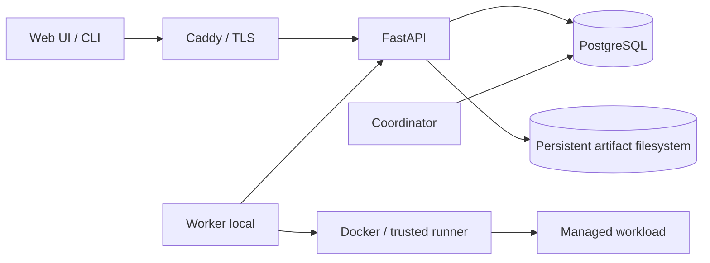

# Project structure và architecture

Dẫn xuất từ [PLAN.md](../PLAN.md) §3–§5, §7–§11, §13–§14; **PLAN được ưu tiên nếu có mâu thuẫn**. Trách nhiệm module đã được khóa; cây thư mục cấp boundary đã được dựng bằng marker theo yêu cầu scaffold được duyệt. B02 đã thêm bootstrap source/config/tests và web toolchain tối thiểu; B03 đã thêm simulator/baseline thuần dưới `benchmarks/` và được focused Task Review duyệt ngày 19/09/2026. Các vị trí product implementation dưới đây vẫn là quy ước placement, không phải sản phẩm đã tồn tại hay một kiến trúc mới.

## Current repository structure

Cây file làm việc hiện tại sau khi B03 hoàn tất (không liệt kê metadata `.git/` và generated/cache đã ignore):

```text
.
├── .agents/
│   └── skills/
│       ├── benchmarking-scheduler-fairness/
│       │   └── SKILL.md
│       └── verifying-recovery-fencing/
│           └── SKILL.md
├── .github/
│   └── workflows/
│       └── ci.yml
├── .env.example
├── .gitignore
├── AGENTS.md
├── PLAN.md
├── README.md
├── ROADMAP.md
├── benchmarks/
│   ├── __init__.py
│   ├── fixtures/
│   │   ├── small-trace.json
│   │   └── standard-trace.json
│   ├── plots/
│   │   ├── b03-comparison.csv
│   │   └── b03-comparison.svg
│   ├── results/
│   │   └── b03-baselines.json
│   └── simulator/
│       ├── __init__.py
│       ├── baselines.py
│       ├── cli.py
│       ├── clock.py
│       ├── engine.py
│       ├── metrics.py
│       ├── model.py
│       ├── policy.py
│       ├── report.py
│       └── trace.py
├── deploy/
│   └── .gitkeep
├── docs/
│   ├── acceptance.md
│   ├── adr/
│   │   ├── 0001-process-boundaries-and-trust.md
│   │   ├── 0002-authoritative-state-and-durable-blob-commit.md
│   │   ├── 0003-worker-authority-fencing-and-cleanup.md
│   │   └── 0004-checkpoint-manifest-and-compatibility.md
│   ├── adr.md
│   ├── agent-setup.md
│   ├── contracts.md
│   ├── contracts/
│   │   ├── concurrency-recovery.md
│   │   ├── domain-model.md
│   │   ├── examples/
│   │   │   ├── checkpoint-manifest.json
│   │   │   ├── chunk-output-manifest.json
│   │   │   └── result-manifest.json
│   │   ├── internal-interfaces.md
│   │   ├── openapi.yaml
│   │   ├── schemas/
│   │   │   └── workload-manifests.schema.json
│   │   ├── state-machines.md
│   │   └── workloads-checkpoints.md
│   ├── environment-inventory.md
│   ├── evidence/
│   │   ├── B01-contract-review.md
│   │   ├── B02-bootstrap.md
│   │   └── B03-simulator.md
│   ├── invariants.md
│   ├── requirements-traceability.md
│   ├── superpowers/
│   │   └── plans/
│   │       ├── 2026-09-18-b02-bootstrap.md
│   │       └── 2026-09-18-b03-simulator.md
│   └── project-structure.md
├── migrations/
│   └── .gitkeep
├── scripts/
│   └── .gitkeep
├── pyproject.toml
├── uv.lock
├── src/
│   └── nexa/
│       ├── __init__.py
│       ├── api/
│       │   └── .gitkeep
│       ├── application/
│       │   └── .gitkeep
│       ├── cli/
│       │   └── .gitkeep
│       ├── coordinator/
│       │   └── .gitkeep
│       ├── config.py
│       ├── domain/
│       │   └── .gitkeep
│       ├── infrastructure/
│       │   └── .gitkeep
│       ├── scheduler/
│       │   └── .gitkeep
│       ├── worker/
│       │   └── .gitkeep
│       └── workloads/
│           └── .gitkeep
├── tests/
│   ├── benchmarks/
│   │   ├── conftest.py
│   │   ├── test_cli.py
│   │   ├── test_clock.py
│   │   ├── test_drf.py
│   │   ├── test_drr.py
│   │   ├── test_engine.py
│   │   ├── test_fifo.py
│   │   ├── test_metrics.py
│   │   ├── test_model.py
│   │   ├── test_properties.py
│   │   ├── test_reproducibility.py
│   │   ├── test_round_robin.py
│   │   └── test_trace.py
│   ├── test_config.py
│   └── test_package.py
└── web/
    ├── index.html
    ├── package.json
    ├── pnpm-lock.yaml
    ├── src/
    │   ├── App.tsx
    │   ├── main.tsx
    │   ├── styles.css
    │   └── vite-env.d.ts
    ├── tests/
    │   └── .gitkeep
    ├── tsconfig.app.json
    ├── tsconfig.json
    ├── tsconfig.node.json
    └── vite.config.ts
```

Hiện có bộ contract B01, bootstrap B02, hai project skills, Python/UI lockfiles, web shell build được, CI quality-only và B03 simulator/baseline đã được focused Task Review duyệt. B03 gồm virtual clock, immutable model, canonical trace/materialization, simulator engine, five baselines, metrics, CLI/report, fixtures, selected raw/CSV/SVG evidence và unit/property tests. Remediation cuối kiểm tra quota feasibility theo fixed point sau mỗi exclusion và giữ Jain không xác định dưới dạng `N/A` trong SVG. `PLAN.md` thuộc quyết định thiết kế được user duyệt; `AGENTS.md` thuộc hướng dẫn agent; `README.md` điều hướng và mô tả trạng thái; `.gitignore` quản lý hygiene. `docs/` thuộc trách nhiệm task tương ứng với contract/gate được thay đổi, không phải một owner cá nhân đã được phân công.

`ROADMAP.md` xuất hiện như một file untracked đồng thời trong lúc verification cuối; B02 chỉ đọc để xác nhận không xung đột và không tạo, sửa hoặc nhận ownership file này.

Các leaf directory chưa có file thực vẫn giữ một `.gitkeep` rỗng (0 byte), tổng cộng 13 marker sau khi `tests/.gitkeep`, `.github/workflows/.gitkeep` và `benchmarks/.gitkeep` được thay bằng file thật. `web/tests/.gitkeep` vẫn còn vì chưa có Playwright/product UI tests. Marker còn lại chỉ giữ directory boundary; không chứa source, migration hay runtime config.

**Bootstrap và simulator không phải product implementation hay runtime acceptance evidence.** Remediation và focused rereview B01 đã đóng R-03, R-05 và R-09 nên ACC-01 là `pass`, nhưng mọi gate runtime/product khác vẫn theo status đã ghi. B03 evidence chỉ thuộc lớp D; nó không chứng minh API, production scheduler, recovery, Linux, PostgreSQL, Docker hoặc GPU.

`.agents/skills/` đã tồn tại và chứa hai skill instruction-only, thuộc công cụ hỗ trợ agent, không phải module runtime:

| Skill hiện có | Trách nhiệm |
|---|---|
| [benchmarking-scheduler-fairness](../.agents/skills/benchmarking-scheduler-fairness/SKILL.md) | Hướng dẫn chạy/review evidence fairness, aging, reservation, queue scalability và load benchmark; phân biệt simulator với runtime |
| [verifying-recovery-fencing](../.agents/skills/verifying-recovery-fencing/SKILL.md) | Hướng dẫn kiểm thử/tổng hợp evidence lease/fence/stale callback/control race, quarantine, checkpoint recovery và reconciliation |

Hai skill đọc PLAN/invariants/acceptance, không thay đổi boundary hoặc tự chứng nhận gate sản phẩm. B03 có simulator benchmark harness thuần nhưng chưa có product/recovery/load harness; validity của skill hoặc simulator không chứng minh runtime acceptance.

## B03 simulator boundary

`benchmarks/simulator/` là implementation lớp D độc lập với `src/nexa/`. `SchedulingSnapshot` là dữ liệu bất biến; mỗi baseline chỉ chọn một `job_id` hoặc `None`, còn engine giữ state, cấp/release tài nguyên và từ chối lựa chọn vi phạm invariant. Toàn bộ thời gian và tài nguyên dùng số nguyên; so sánh tỷ lệ dùng `Fraction`; local seeded RNG chỉ được dùng khi materialize trace. Raw JSON canonical không chứa system timestamp hay wall-clock duration.

`benchmarks/fixtures/` chứa trace source-controlled. `benchmarks/results/b03-baselines.json` là raw evidence đã chọn; CSV/SVG dưới `benchmarks/plots/` được tạo lại chỉ từ raw bundle. `benchmarks/tmp/` và output chưa chọn vẫn là temporary/ignored. B03 không import `src/nexa`, không triển khai B04 policy và không tạo API, database, Docker, worker, coordinator, CLI sản phẩm hay Web UI.

## Approved target placement

**Các directory product boundary dưới đây đã có scaffold; implementation sản phẩm bên trong chưa tồn tại.** B02 chỉ đặt bootstrap package/config ở `src/nexa/` root và static shell trong `web/`; các module boundary con vẫn giữ marker. `docs/` tiếp tục giữ vai trò tài liệu; hai project skills được liệt kê ở phần current structure phía trên. PLAN quy định module/đầu ra, không quy định tên từng Python package. Mapping này phân bổ đầu ra đã duyệt vào repository để B01/B02 cụ thể hóa; thay tên đường dẫn được cập nhật tại đây, thay boundary/stack cần duyệt theo [ADR](adr.md).

| Vị trí đã duyệt | Trách nhiệm và ownership logic | Interface / dependency được phép | Backlog |
|---|---|---|---|
| `src/nexa/domain/` | Domain types, resource vector, state/invariant, contract nội bộ | Không import API, ORM, Docker, UI hay framework ML; contract dùng chung không mở quyền truy cập DB cho worker | B01, B05 |
| `src/nexa/scheduler/` | Policy thuần, candidate ordering, aging/reservation | Implements `SchedulerPolicy`, nhận snapshot/clock/trace; chỉ phụ thuộc domain, không gọi Docker/DB/PyTorch | B04, B13 |
| `src/nexa/application/` | Use cases, authorization/ownership, transaction orchestration | Domain/policy và các interface; dùng adapter persistence/artifact qua composition của process | B06–B08, B11, B14–B15 |
| `src/nexa/api/` | REST `/v1`, browser/CLI/worker transport, error mapping | Application/domain, persistence/artifact adapter được wire tại process; không Docker socket | B06–B08, B11, B15 |
| `src/nexa/coordinator/` | Leadership, scheduling tick, allocation, reaper/recovery | Scheduler/application + persistence; recheck dưới transaction; không điều khiển Docker trực tiếp | B11, B13, B15 |
| `src/nexa/infrastructure/` | PostgreSQL repositories/transaction helpers, filesystem artifact adapter, metrics/log adapters | Implements contract domain/application/`ArtifactStore`; không import UI/CLI hay quyết định scheduler | B05, B07, B19 |
| `src/nexa/worker/` | Local identity/incarnation, heartbeat/poll, inventory, singleton/reconcile, executor | API client cho control plane; `ResourceProvider` và `Executor`; Docker socket chỉ tại worker; không query DB trực tiếp | B09–B10, B23 |
| `src/nexa/workloads/` | Trusted runner, `WorkloadAdapter`, CPU/PyTorch/sweep/chunk contracts | Adapter gọi framework ML trong workload image; runner bảo vệ lease channel; workload không có credential worker | B09, B14, B16, B23 |
| `src/nexa/cli/` | Typer CLI và bootstrap/admin commands theo scope | User/admin flows qua REST API; bootstrap identity là đường vận hành đặc quyền theo PLAN §10, không cho workload dùng | B02, B06, B12, B15 |
| `web/` | React/TypeScript/Vite UI user/admin | Chỉ REST API; không truy cập DB/filesystem/Docker hoặc tự quyết định quyền/state | B17–B18 |
| `tests/` | Unit/property, PostgreSQL integration, race/fault/security, contract/adapter fixtures | B03 tests dùng simulator thuần; test task sau dùng code sản phẩm và không bypass auth/counter trong tải nghiệm thu | B03–B23 |
| `web/tests/` | Playwright flows và kiểm tra UI | Backend thật cho acceptance UI; cursor, ownership và control theo API | B17–B18, B20 |
| `migrations/` | Alembic schema/version/index/constraint | Persistence schema và contract migration; luôn source-controlled | B05, B21, B25 |
| `benchmarks/` | B03 hiện có simulator/baseline/seeded trace/metrics/report; task sau bổ sung policy, load/chaos | B03 policy contract chỉ thuộc simulator; worker simulator sau này phải dùng protocol chuẩn và chỉ bật trong test | B03–B04, B13, B22–B24 |
| `scripts/` | Công cụ bootstrap, demo và vận hành tái lập | Gọi các interface/command đã có; không chứa secret | B02, B21, B24–B25 |
| `docs/` | Contract, invariant, acceptance, runbook và ADR | Dẫn về PLAN; không phải nguồn quyết định cạnh tranh | B01 và mọi task đổi contract |
| `docs/adr/` | Bản ghi quyết định khi có trigger theo `docs/adr.md`; hiện có ADR-0001–0004 của B01 | Dẫn về PLAN và contract liên quan; không dùng ADR để thay quyết định đã khóa | Task phát sinh quyết định |
| `docs/evidence/` | Báo cáo, raw evidence được chọn, manifest cấu hình/commit/seed/digest | Source-controlled, được gate liên kết; bảo toàn raw data cần tái tạo kết quả và loại secret | B03–B25 |
| `pyproject.toml`, `uv.lock`; `web/package.json`, `web/pnpm-lock.yaml` | Python/UI manifests và lockfiles | Đã tồn tại, frozen install được kiểm chứng và không bị ignore | B02 |
| `deploy/`, `.github/workflows/` | Vị trí cho Caddy/Compose/image assets và CI/release | CI B02 quality-only đã có; `deploy/` vẫn chỉ có marker và chưa có deployment/release logic | B02, B09, B21, B25 |
| `.env.example`, `compose.yaml` | Config mẫu và Compose | `.env.example` an toàn đã có; `compose.yaml` chưa tạo; không hardcode host, credential hoặc path máy phát triển | B02, B09, B21, B25 |

Sweep parent là nhóm theo dõi, không phải execution service mới hay slot; child dùng submit API/idempotency/quota bình thường. Một repository/modular monolith vẫn có API và coordinator process riêng, worker local và workload container riêng.

## Boundary runtime và nguồn dữ liệu



PostgreSQL giữ tenant/user/membership/token, job/session/attempt, queue/allocation/GPU UUID, lease/quota/ledger/counter, idempotency/audit/event và blob metadata. Filesystem giữ input/checkpoint/result và log đã chốt bất biến. Không biến heap/cache/Prometheus thành nguồn state thứ hai. Hướng import đi từ transport/orchestration/adapter vào contract/domain; domain và policy không phụ thuộc các lớp bên ngoài. `Executor` thuộc worker, `WorkloadAdapter` thuộc runner/workload, `ArtifactStore` phục vụ artifact service; `ResourceProvider` đưa capability vào protocol worker và snapshot scheduler.

## Phân loại file và dữ liệu

Chỉ source-controlled file và directory được liệt kê trong cây current structure. Generated/temporary/cache như `web/node_modules/`, `web/dist/`, Python bytecode và pytest/Ruff cache có thể tồn tại local sau verification nhưng đã ignore và không phải source/evidence; runtime data và secret/local config thật chưa được tạo.

| Loại | Vị trí / ví dụ theo quy ước | Quy tắc |
|---|---|---|
| Tài liệu/hướng dẫn hiện có | `PLAN.md`, `README.md`, `AGENTS.md`, `.gitignore`, các file Markdown trong `docs/` và hai `.agents/skills/*/SKILL.md` | Nội dung thực đã tồn tại; hướng dẫn/specification không thay bằng chứng runtime |
| Scaffold cần Git lưu lại | 13 `.gitkeep` trong cây current structure | Marker rỗng, chỉ giữ directory boundary chưa có file thực; không phải implementation hoặc evidence |
| Tài liệu B01 đã source-control-ready | `docs/adr/0001`–`0004`, `docs/evidence/B01-contract-review.md`, OpenAPI/schema/traceability/inventory | Đã tồn tại trong working tree B01; là specification/evidence tài liệu, không phải runtime implementation |
| Bootstrap source-controlled hiện có | `pyproject.toml`, `uv.lock`, `src/nexa/__init__.py`, `src/nexa/config.py`, `tests/test_*.py`, `.env.example`, `web/package.json`, `web/pnpm-lock.yaml`, TypeScript/Vite source/config, `.github/workflows/ci.yml`, `docs/evidence/B02-bootstrap.md` | Chứng minh package/config/UI toolchain và CI tối thiểu; không chứa product behavior hoặc credential |
| B03 simulator source/evidence | `benchmarks/simulator/`, `benchmarks/fixtures/`, selected `benchmarks/results/` and `benchmarks/plots/`, `tests/benchmarks/`, `docs/evidence/B03-simulator.md` | Lớp D deterministic; không phải production scheduler, runtime benchmark, Linux/Docker/GPU evidence hoặc acceptance pass |
| Source-controlled khi task sau triển khai | Product source/tests/fixtures, migrations, benchmark/plot scripts và evidence runtime bổ sung trong `docs/evidence/` | Tạo theo task có scope phù hợp, review cùng contract/gate; không chứa credential hoặc dữ liệu private của workload |
| Generated files | `build/`, `dist/`, `*.egg-info/`, `*.tsbuildinfo`, coverage/test reports tạm | Tái tạo từ source, ignore; báo cáo chọn để nghiệm thu chuyển vào `docs/evidence/` kèm provenance |
| Runtime data | Volume DB/artifact thật đặt ngoài checkout; mapping local tại `runtime/`, `data/postgres/`, `data/artifacts/`, `data/checkpoints/`, `data/logs/` hoặc `pgdata/`, `artifacts/`, `checkpoints/`, `logs/` ở root | Ignore không phải backup; giữ durability/permission/consistent backup theo PLAN |
| Temporary/cache | `.venv/`, `node_modules/`, Python/Node/tool cache, `tmp/`, `temp/`, `benchmarks/tmp/`, `benchmarks/output/` | Có thể tái tạo; output chưa chọn không phải evidence acceptance |
| Secrets/local-only | `.env`, `.env.*` trừ example; `secrets/`, `config/local/`, `*.local`, private key/cert; `.idea/`, `.vscode/` | Không commit; dùng Compose secret/config validation khi triển khai |

Không ignore toàn bộ `data/`, `benchmarks/`, `*.log`, `*.json` hay `*.csv`, vì có thể chứa fixture/raw evidence cần lưu. Lockfiles, migration, `.env.example` và `.agents/skills` phải còn hiển thị với Git. Nếu đổi placement runtime, cập nhật `.gitignore` và kiểm tra cả path cần ignore lẫn path phải bảo toàn.
