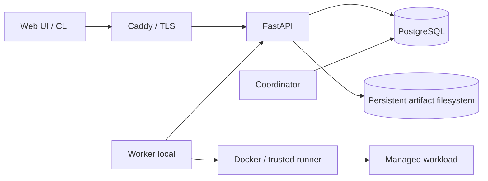

# Project structure và architecture

Dẫn xuất từ [PLAN.md](../PLAN.md) §3–§5, §7–§11, §13–§14; **PLAN được ưu tiên nếu có mâu thuẫn**. Trách nhiệm module đã được khóa; cây thư mục cấp boundary đã được dựng bằng marker theo yêu cầu scaffold được duyệt. Các vị trí implementation dưới đây vẫn là quy ước placement cho triển khai, không phải source đã tồn tại hay một kiến trúc mới.

## Current repository structure

Cây file làm việc hiện tại sau setup, Skill Creator và directory scaffold (không liệt kê metadata `.git/`):

```text
.
├── .agents/
│   └── skills/
│       ├── benchmarking-scheduler-fairness/
│       │   └── SKILL.md
│       └── verifying-recovery-fencing/
│           └── SKILL.md
├── .github/
│   └── workflows/
│       └── .gitkeep
├── .gitignore
├── AGENTS.md
├── PLAN.md
├── README.md
├── benchmarks/
│   └── .gitkeep
├── deploy/
│   └── .gitkeep
├── docs/
│   ├── acceptance.md
│   ├── adr/
│   │   └── .gitkeep
│   ├── adr.md
│   ├── agent-setup.md
│   ├── contracts.md
│   ├── evidence/
│   │   └── .gitkeep
│   ├── invariants.md
│   └── project-structure.md
├── migrations/
│   └── .gitkeep
├── scripts/
│   └── .gitkeep
├── src/
│   └── nexa/
│       ├── api/
│       │   └── .gitkeep
│       ├── application/
│       │   └── .gitkeep
│       ├── cli/
│       │   └── .gitkeep
│       ├── coordinator/
│       │   └── .gitkeep
│       ├── domain/
│       │   └── .gitkeep
│       ├── infrastructure/
│       │   └── .gitkeep
│       ├── scheduler/
│       │   └── .gitkeep
│       ├── worker/
│       │   └── .gitkeep
│       └── workloads/
│           └── .gitkeep
├── tests/
│   └── .gitkeep
└── web/
    └── tests/
        └── .gitkeep
```

Hiện có tài liệu, hai project skills và scaffold; chưa có module executable. `PLAN.md` thuộc quyết định thiết kế được user duyệt; `AGENTS.md` thuộc hướng dẫn agent; `README.md` điều hướng và mô tả trạng thái; `.gitignore` quản lý hygiene. `docs/` thuộc trách nhiệm người làm task tương ứng với contract/gate được thay đổi, không phải một owner cá nhân đã được phân công. File mới của setup/scaffold chưa được stage hoặc commit tự động.

Mỗi leaf directory mới trong cây trên chỉ chứa một `.gitkeep` rỗng (0 byte), tổng cộng 18 marker. Marker giúp Git lưu lại vị trí boundary khi được thêm vào version control; không chứa source, test, migration, workflow hay runtime config. Không tạo thêm thư mục con giả định cho implementation. Khi task triển khai thêm file thực vào leaf directory, marker không còn cần thiết.

**Scaffold không phải implementation, không hoàn tất B01/B02 và không phải acceptance evidence.** `docs/evidence/.gitkeep` không chứng minh gate nào đạt; `docs/adr/.gitkeep` không phải bản ghi quyết định hoặc template ADR. Các gate sản phẩm vẫn là `specified`; chưa chạy product test/build vì chưa có implementation hoặc test runner.

`.agents/skills/` đã tồn tại và chứa hai skill instruction-only, thuộc công cụ hỗ trợ agent, không phải module runtime:

| Skill hiện có | Trách nhiệm |
|---|---|
| [benchmarking-scheduler-fairness](../.agents/skills/benchmarking-scheduler-fairness/SKILL.md) | Hướng dẫn chạy/review evidence fairness, aging, reservation, queue scalability và load benchmark; phân biệt simulator với runtime |
| [verifying-recovery-fencing](../.agents/skills/verifying-recovery-fencing/SKILL.md) | Hướng dẫn kiểm thử/tổng hợp evidence lease/fence/stale callback/control race, quarantine, checkpoint recovery và reconciliation |

Hai skill đọc PLAN/invariants/acceptance, không thay đổi boundary hoặc tự chứng nhận gate sản phẩm. Chưa có product code hay benchmark/recovery harness; validity của skill không chứng minh runtime acceptance.

## Approved target placement

**Các directory boundary dưới đây đã có scaffold; implementation bên trong chưa tồn tại.** `web/` hiện chỉ chứa `tests/.gitkeep`; `.github/`, `src/` và `src/nexa/` là các thư mục cha. `docs/` tiếp tục giữ vai trò tài liệu; hai project skills được liệt kê ở phần current structure phía trên. Manifest, lockfile và config chỉ là target, chưa được tạo. PLAN quy định module/đầu ra, không quy định tên từng Python package. Mapping này phân bổ đầu ra đã duyệt vào repository để B01/B02 cụ thể hóa; thay tên đường dẫn được cập nhật tại đây, thay boundary/stack cần duyệt theo [ADR](adr.md).

| Vị trí đã duyệt | Trách nhiệm và ownership logic | Interface / dependency được phép | Backlog |
|---|---|---|---|
| `src/nexa/domain/` | Domain types, resource vector, state/invariant, contract nội bộ | Không import API, ORM, Docker, UI hay framework ML; contract dùng chung không mở quyền truy cập DB cho worker | B01, B05 |
| `src/nexa/scheduler/` | Policy thuần, candidate ordering, aging/reservation | Implements `SchedulerPolicy`, nhận snapshot/clock/trace; chỉ phụ thuộc domain, không gọi Docker/DB/PyTorch | B04, B13 |
| `src/nexa/application/` | Use cases, authorization/ownership, transaction orchestration | Domain/policy và các interface; dùng adapter persistence/artifact qua composition của process | B06–B08, B11, B14–B15 |
| `src/nexa/api/` | REST `/v1`, browser/CLI/worker transport, error mapping | Application/domain, persistence/artifact adapter được wire tại process; không Docker socket | B06–B08, B11, B15 |
| `src/nexa/coordinator/` | Leadership, scheduling tick, allocation, reaper/recovery | Scheduler/application + persistence; recheck dưới transaction; không điều khiển Docker trực tiếp | B11, B13, B15 |
| `src/nexa/infrastructure/` | PostgreSQL repositories/transaction helpers, filesystem artifact adapter, metrics/log adapters | Implements contract domain/application/`ArtifactStore`; không import UI/CLI hay quyết định scheduler | B05, B07, B19 |
| `src/nexa/worker/` | Local identity/incarnation, heartbeat/poll, inventory, singleton/reconcile, executor | API client cho control plane; `ResourceProvider` và `Executor`; Docker socket chỉ tại worker; không query DB trực tiếp | B09–B10, B23 |
| `src/nexa/workloads/` | Trusted runner, `WorkloadAdapter`, CPU/PyTorch/sweep/chunk contracts | Adapter gọi framework ML trong workload image; runner bảo vệ lease channel; workload không có credential worker | B09, B14, B16, B23 |
| `src/nexa/cli/` | Typer CLI và bootstrap/admin commands theo scope | User/admin flows qua REST API; bootstrap identity là đường vận hành đặc quyền theo PLAN §10, không cho workload dùng | B02, B06, B12, B15 |
| `web/` | React/TypeScript/Vite UI user/admin | Chỉ REST API; không truy cập DB/filesystem/Docker hoặc tự quyết định quyền/state | B17–B18 |
| `tests/` | Unit/property, PostgreSQL integration, race/fault/security, contract/adapter fixtures | Dùng code sản phẩm; kiểm tra boundary và invariant, không bypass auth/counter trong tải nghiệm thu | B03–B23 |
| `web/tests/` | Playwright flows và kiểm tra UI | Backend thật cho acceptance UI; cursor, ownership và control theo API | B17–B18, B20 |
| `migrations/` | Alembic schema/version/index/constraint | Persistence schema và contract migration; luôn source-controlled | B05, B21, B25 |
| `benchmarks/` | Simulator, baseline, seed/trace fixtures, load/chaos và plot scripts | Policy dùng chung; worker simulator dùng protocol chuẩn và chỉ bật trong test | B03–B04, B13, B22–B24 |
| `scripts/` | Công cụ bootstrap, demo và vận hành tái lập | Gọi các interface/command đã có; không chứa secret | B02, B21, B24–B25 |
| `docs/` | Contract, invariant, acceptance, runbook và ADR | Dẫn về PLAN; không phải nguồn quyết định cạnh tranh | B01 và mọi task đổi contract |
| `docs/adr/` | Bản ghi quyết định khi có trigger theo `docs/adr.md`; hiện chỉ có marker | Dẫn về PLAN và contract liên quan; không dùng ADR để thay quyết định đã khóa | Task phát sinh quyết định |
| `docs/evidence/` | Báo cáo, raw evidence được chọn, manifest cấu hình/commit/seed/digest | Source-controlled, được gate liên kết; bảo toàn raw data cần tái tạo kết quả và loại secret | B03–B25 |
| `pyproject.toml`, `uv.lock`; `web/package.json`, `web/pnpm-lock.yaml` | Python/UI manifests và lockfiles | Chỉ tạo khi bootstrap; lockfile không bị ignore | B02 |
| `deploy/`, `.github/workflows/` | Vị trí cho Caddy/Compose/image assets và CI/release; hiện mỗi thư mục chỉ có marker | Chưa có config hoặc workflow logic; khi triển khai không hardcode host, secret local riêng | B02, B09, B21, B25 |
| `.env.example`, `compose.yaml` | Config mẫu và Compose chưa được tạo | Chỉ tạo trong task triển khai phù hợp; không hardcode host, secret local riêng | B02, B09, B21, B25 |

Sweep parent là nhóm theo dõi, không phải execution service mới hay slot; child dùng submit API/idempotency/quota bình thường. Một repository/modular monolith vẫn có API và coordinator process riêng, worker local và workload container riêng.

## Boundary runtime và nguồn dữ liệu



PostgreSQL giữ tenant/user/membership/token, job/session/attempt, queue/allocation/GPU UUID, lease/quota/ledger/counter, idempotency/audit/event và blob metadata. Filesystem giữ input/checkpoint/result và log đã chốt bất biến. Không biến heap/cache/Prometheus thành nguồn state thứ hai. Hướng import đi từ transport/orchestration/adapter vào contract/domain; domain và policy không phụ thuộc các lớp bên ngoài. `Executor` thuộc worker, `WorkloadAdapter` thuộc runner/workload, `ArtifactStore` phục vụ artifact service; `ResourceProvider` đưa capability vào protocol worker và snapshot scheduler.

## Phân loại file và dữ liệu

Chỉ các file và directory trong cây current structure đã tồn tại. Mọi generated/runtime/temporary/cache path và secret/local config nêu dưới đây đều chưa được tạo; chúng là quy ước cho task triển khai sau này.

| Loại | Vị trí / ví dụ theo quy ước | Quy tắc |
|---|---|---|
| Tài liệu/hướng dẫn hiện có | `PLAN.md`, `README.md`, `AGENTS.md`, `.gitignore`, các file Markdown trong `docs/` và hai `.agents/skills/*/SKILL.md` | Nội dung thực đã tồn tại; hướng dẫn/specification không thay bằng chứng runtime |
| Scaffold cần Git lưu lại | 18 `.gitkeep` trong cây current structure | Marker rỗng, chỉ giữ directory boundary; không phải implementation hoặc evidence |
| Source-controlled khi triển khai | Source/tests/fixtures, lockfiles, migrations, bản ghi ADR, `.env.example`, benchmark/plot scripts và evidence thực trong `docs/evidence/` | Chưa có các file này; tạo theo task có scope phù hợp, review cùng contract/gate; không chứa credential hoặc dữ liệu private của workload |
| Generated files | `build/`, `dist/`, `*.egg-info/`, `*.tsbuildinfo`, coverage/test reports tạm | Tái tạo từ source, ignore; báo cáo chọn để nghiệm thu chuyển vào `docs/evidence/` kèm provenance |
| Runtime data | Volume DB/artifact thật đặt ngoài checkout; mapping local tại `runtime/`, `data/postgres/`, `data/artifacts/`, `data/checkpoints/`, `data/logs/` hoặc `pgdata/`, `artifacts/`, `checkpoints/`, `logs/` ở root | Ignore không phải backup; giữ durability/permission/consistent backup theo PLAN |
| Temporary/cache | `.venv/`, `node_modules/`, Python/Node/tool cache, `tmp/`, `temp/`, `benchmarks/tmp/`, `benchmarks/output/` | Có thể tái tạo; output chưa chọn không phải evidence acceptance |
| Secrets/local-only | `.env`, `.env.*` trừ example; `secrets/`, `config/local/`, `*.local`, private key/cert; `.idea/`, `.vscode/` | Không commit; dùng Compose secret/config validation khi triển khai |

Không ignore toàn bộ `data/`, `benchmarks/`, `*.log`, `*.json` hay `*.csv`, vì có thể chứa fixture/raw evidence cần lưu. Lockfiles, migration, `.env.example` và `.agents/skills` phải còn hiển thị với Git. Nếu đổi placement runtime, cập nhật `.gitignore` và kiểm tra cả path cần ignore lẫn path phải bảo toàn.
