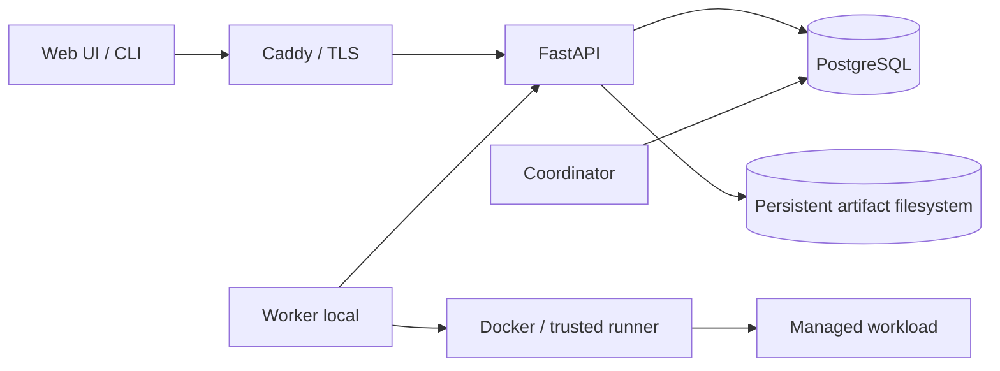

# Project structure và architecture

Dẫn xuất từ [PLAN.md](../PLAN.md) §3–§5, §7–§11, §13–§14; **PLAN được ưu tiên nếu có mâu thuẫn**. Trách nhiệm module đã được khóa; cây thư mục cấp boundary đã được dựng bằng marker theo yêu cầu scaffold được duyệt. B01–B08 đã được Task Review duyệt theo các xác nhận hiện có. B09 đã có implementation, tests và Docker Desktop evidence, đang chờ Task Review; các gate Linux-host/runtime còn lại không được suy ra từ evidence phát triển.

## Current repository structure

Cây file làm việc hiện tại sau khi B09 được implement (không liệt kê metadata `.git/` và generated/cache đã ignore):

```text
.
├── .agents/
│   └── skills/
│       ├── benchmarking-scheduler-fairness/
│       │   └── SKILL.md
│       └── verifying-recovery-fencing/
│           └── SKILL.md
├── .github/
│   └── workflows/
│       └── ci.yml
├── .env.example
├── .gitignore
├── AGENTS.md
├── alembic.ini
├── PLAN.md
├── README.md
├── ROADMAP.md
├── benchmarks/
│   ├── __init__.py
│   ├── b04/
│   │   ├── __init__.py
│   │   ├── adapter.py
│   │   ├── checks.py
│   │   ├── cli.py
│   │   ├── engine.py
│   │   ├── report.py
│   │   └── suite.py
│   ├── fixtures/
│   │   ├── b04-constrained-diagnostic.json
│   │   ├── b04-gpu-slots.json
│   │   ├── b04-large-reservation.json
│   │   ├── b04-mixed-equal.json
│   │   ├── b04-suite.json
│   │   ├── b04-uniform-equal.json
│   │   ├── b04-weighted-124.json
│   │   ├── small-trace.json
│   │   └── standard-trace.json
│   ├── plots/
│   │   ├── b03-comparison.csv
│   │   ├── b03-comparison.svg
│   │   ├── b04-fairness.csv
│   │   └── b04-fairness.svg
│   ├── results/
│   │   ├── b03-baselines.json
│   │   └── b04-fairness.json
│   └── simulator/
│       ├── __init__.py
│       ├── baselines.py
│       ├── cli.py
│       ├── clock.py
│       ├── engine.py
│       ├── metrics.py
│       ├── model.py
│       ├── policy.py
│       ├── report.py
│       └── trace.py
├── deploy/
│   ├── .gitkeep
│   └── cpu-iterative/
│       ├── Dockerfile
│       └── runner-config.json
├── docs/
│   ├── acceptance.md
│   ├── adr/
│   │   ├── 0001-process-boundaries-and-trust.md
│   │   ├── 0002-authoritative-state-and-durable-blob-commit.md
│   │   ├── 0003-worker-authority-fencing-and-cleanup.md
│   │   └── 0004-checkpoint-manifest-and-compatibility.md
│   ├── adr.md
│   ├── agent-setup.md
│   ├── contracts.md
│   ├── database.md
│   ├── contracts/
│   │   ├── concurrency-recovery.md
│   │   ├── domain-model.md
│   │   ├── examples/
│   │   │   ├── checkpoint-manifest.json
│   │   │   ├── chunk-output-manifest.json
│   │   │   └── result-manifest.json
│   │   ├── internal-interfaces.md
│   │   ├── openapi.yaml
│   │   ├── schemas/
│   │   │   └── workload-manifests.schema.json
│   │   ├── state-machines.md
│   │   └── workloads-checkpoints.md
│   ├── environment-inventory.md
│   ├── evidence/
│   │   ├── B01-contract-review.md
│   │   ├── B02-bootstrap.md
│   │   ├── B03-simulator.md
│   │   ├── B04-fairness.md
│   │   ├── B05-postgresql.md
│   │   ├── B09-docker-executor-trusted-runner.md
│   │   └── raw/
│   │       ├── B09-container-config.json
│   │       ├── B09-docker-scenarios.jsonl
│   │       ├── B09-image.json
│   │       ├── B09-probe.json
│   │       └── B09-smoke.json
│   ├── invariants.md
│   ├── requirements-traceability.md
│   ├── superpowers/
│   │   └── plans/
│   │       ├── 2026-09-18-b02-bootstrap.md
│   │       ├── 2026-09-18-b03-simulator.md
│   │       ├── 2026-09-19-b04-fairness-policy.md
│   │       ├── 2026-09-19-b05-postgresql.md
│   │       └── 2026-09-20-b09-docker-executor-trusted-runner.md
│   ├── project-structure.md
│   ├── trusted-runner.md
│   └── worker-executor.md
├── migrations/
│   ├── env.py
│   ├── script.py.mako
│   └── versions/
│       ├── 20260919_0001_b05_initial.py
│       ├── 20260920_0002_b06_identity_runtime.py
│       └── 20260920_0003_b07_artifact_storage.py
├── scripts/
│   ├── .gitkeep
│   ├── b09_build_image.sh
│   ├── b09_docker_tests.sh
│   ├── b09_probe.py
│   └── b09_smoke.sh
├── pyproject.toml
├── uv.lock
├── src/
│   └── nexa/
│       ├── __init__.py
│       ├── api/
│       │   └── .gitkeep
│       ├── application/
│       │   └── .gitkeep
│       ├── cli/
│       │   └── .gitkeep
│       ├── coordinator/
│       │   └── .gitkeep
│       ├── config.py
│       ├── domain/
│       │   ├── .gitkeep
│       │   ├── __init__.py
│       │   └── scheduling.py
│       ├── infrastructure/
│       │   ├── __init__.py
│       │   └── persistence/
│       │       ├── database.py
│       │       ├── ids.py
│       │       ├── locking.py
│       │       ├── schema.py
│       │       ├── schema_guard.py
│       │       ├── schema_v1.py
│       │       ├── transactions.py
│       │       └── values.py
│       ├── scheduler/
│       │   ├── .gitkeep
│       │   ├── __init__.py
│       │   ├── accounting.py
│       │   └── policy.py
│       ├── worker/
│       │   ├── __init__.py
│       │   ├── capabilities.py
│       │   ├── docker_client.py
│       │   ├── docker_config.py
│       │   ├── errors.py
│       │   ├── executor.py
│       │   ├── journal.py
│       │   ├── models.py
│       │   ├── probes.py
│       │   └── protocol.py
│       └── workloads/
│           ├── __init__.py
│           ├── control_relay.py
│           ├── cpu_entrypoint.py
│           ├── cpu_iterative.py
│           ├── deadline.py
│           ├── trusted_runner.py
│           └── workload_supervisor.py
├── tests/
│   ├── benchmarks/
│   │   ├── b04/
│   │   │   ├── __init__.py
│   │   │   ├── test_adapter.py
│   │   │   ├── test_cli.py
│   │   │   ├── test_engine.py
│   │   │   ├── test_properties.py
│   │   │   └── test_report.py
│   │   ├── conftest.py
│   │   ├── test_cli.py
│   │   ├── test_clock.py
│   │   ├── test_drf.py
│   │   ├── test_drr.py
│   │   ├── test_engine.py
│   │   ├── test_fifo.py
│   │   ├── test_metrics.py
│   │   ├── test_model.py
│   │   ├── test_properties.py
│   │   ├── test_reproducibility.py
│   │   ├── test_round_robin.py
│   │   └── test_trace.py
│   ├── scheduler/
│   │   ├── __init__.py
│   │   ├── test_accounting.py
│   │   ├── test_contract.py
│   │   ├── test_policy.py
│   │   ├── test_properties.py
│   │   └── test_reservation.py
│   ├── integration/
│   │   ├── test_constraints_artifacts.py
│   │   ├── test_constraints_authority_gpu.py
│   │   ├── test_constraints_identity_jobs.py
│   │   ├── test_fairness_persistence.py
│   │   ├── test_indexes.py
│   │   ├── test_migrations.py
│   │   ├── test_schema_guard.py
│   │   └── test_transactions.py
│   ├── persistence/
│   │   ├── test_ids.py
│   │   ├── test_schema_metadata.py
│   │   ├── test_transactions.py
│   │   └── test_values.py
│   ├── worker/
│   │   ├── test_capabilities.py
│   │   ├── test_docker_client.py
│   │   ├── test_docker_config.py
│   │   ├── test_executor.py
│   │   ├── test_executor_races.py
│   │   ├── test_journal.py
│   │   ├── test_models.py
│   │   ├── test_probes.py
│   │   └── test_protocol.py
│   ├── workloads/
│   │   ├── __init__.py
│   │   ├── test_control_relay.py
│   │   ├── test_cpu_entrypoint.py
│   │   ├── test_cpu_iterative.py
│   │   ├── test_deadline.py
│   │   ├── test_runner.py
│   │   └── test_workload_supervisor.py
│   ├── docker/
│   │   ├── __init__.py
│   │   ├── test_real_executor.py
│   │   └── test_real_runner.py
│   ├── test_config.py
│   └── test_package.py
└── web/
    ├── index.html
    ├── package.json
    ├── pnpm-lock.yaml
    ├── src/
    │   ├── App.tsx
    │   ├── main.tsx
    │   ├── styles.css
    │   └── vite-env.d.ts
    ├── tests/
    │   └── .gitkeep
    ├── tsconfig.app.json
    ├── tsconfig.json
    ├── tsconfig.node.json
    └── vite.config.ts
```

Hiện có contract B01, bootstrap B02, simulator B03, fairness policy B04, PostgreSQL schema B05, identity/admin B06, artifact slice B07, submit/durable queue B08 và worker/workload primitives B09. B05 bổ sung 52-table schema generation `1`, immutable schema snapshot, Alembic lifecycle, PostgreSQL constraints/indexes, transaction helpers, schema guard, PostgreSQL 17 tests và CI service; bảng thứ 52 là committed-artifact reference guard dùng để tuần tự hóa reference với cleanup. B06 bổ sung schema generation `2` cùng identity/admin API. B07 thêm `schema_v3.py` như lớp metadata phụ gia và migration `20260920_0003` cho tenant storage counters, cùng filesystem/application/API implementation; migration B05/B06 vẫn bất biến. B08 tái sử dụng schema hiện có, không thêm migration, và thêm `JobService`, REST job routes, strict schemas, race tests và evidence. B09 thêm `ResourceProvider`, Docker CLI/config/executor, journal, strict runner protocol/deadline, bounded input materialization, CPU adapter/image và opt-in Docker tests. PID 1 chạy `1000:1000` không có capability bổ sung; supervisor `1001:1000` đăng ký qua kênh one-shot có kiểm tra peer credential. Local journal không thay PostgreSQL state. `PLAN.md` thuộc quyết định thiết kế được user duyệt; `AGENTS.md` thuộc hướng dẫn agent; `README.md` điều hướng và mô tả trạng thái; `.gitignore` quản lý hygiene. `docs/` thuộc trách nhiệm task tương ứng với contract/gate được thay đổi, không phải một owner cá nhân đã được phân công.

`ROADMAP.md` là tài liệu điều hướng trạng thái task và được cập nhật cùng B09; nó không thay thế PLAN hoặc evidence gate.

B05 bỏ marker khỏi `migrations/` và `src/nexa/infrastructure/` sau khi có file thật. Working tree còn 11 `.gitkeep` rỗng; `domain` và `scheduler` giữ marker lịch sử cạnh source B04, các marker khác giữ boundary chưa có implementation. `web/tests/.gitkeep` vẫn còn vì chưa có Playwright/product UI tests. Marker không chứa source, migration hay runtime config.

**Bootstrap và simulator không phải product implementation hay runtime acceptance evidence.** Remediation và focused rereview B01 đã đóng R-03, R-05 và R-09 nên ACC-01 là `pass`, nhưng mọi gate runtime/product khác vẫn theo status đã ghi. B03 evidence chỉ thuộc lớp D; nó không chứng minh API, production scheduler, recovery, Linux, PostgreSQL, Docker hoặc GPU.

`.agents/skills/` đã tồn tại và chứa hai skill instruction-only, thuộc công cụ hỗ trợ agent, không phải module runtime:

| Skill hiện có | Trách nhiệm |
|---|---|
| [benchmarking-scheduler-fairness](../.agents/skills/benchmarking-scheduler-fairness/SKILL.md) | Hướng dẫn chạy/review evidence fairness, aging, reservation, queue scalability và load benchmark; phân biệt simulator với runtime |
| [verifying-recovery-fencing](../.agents/skills/verifying-recovery-fencing/SKILL.md) | Hướng dẫn kiểm thử/tổng hợp evidence lease/fence/stale callback/control race, quarantine, checkpoint recovery và reconciliation |

Hai skill đọc PLAN/invariants/acceptance, không thay đổi boundary hoặc tự chứng nhận gate sản phẩm. B03 có simulator benchmark harness thuần nhưng chưa có product/recovery/load harness; validity của skill hoặc simulator không chứng minh runtime acceptance.

## B03 simulator boundary

`benchmarks/simulator/` là implementation lớp D độc lập với `src/nexa/`. `SchedulingSnapshot` là dữ liệu bất biến; mỗi baseline chỉ chọn một `job_id` hoặc `None`, còn engine giữ state, cấp/release tài nguyên và từ chối lựa chọn vi phạm invariant. Toàn bộ thời gian và tài nguyên dùng số nguyên; so sánh tỷ lệ dùng `Fraction`; local seeded RNG chỉ được dùng khi materialize trace. Raw JSON canonical không chứa system timestamp hay wall-clock duration.

`benchmarks/fixtures/` chứa trace source-controlled. `benchmarks/results/b03-baselines.json` là raw evidence đã chọn; CSV/SVG dưới `benchmarks/plots/` được tạo lại chỉ từ raw bundle. `benchmarks/tmp/` và output chưa chọn vẫn là temporary/ignored. B03 không import `src/nexa`, không triển khai B04 policy và không tạo API, database, Docker, worker, coordinator, CLI sản phẩm hay Web UI.

## B04 policy và benchmark boundary

`src/nexa/domain/scheduling.py` định nghĩa snapshot/value/result bất biến; `src/nexa/scheduler/accounting.py` và `policy.py` hiện thực weighted dominant resource-time, virtual floor, deterministic ordering, eligible aging và một reservation local. Product code chỉ phụ thuộc domain + standard library, nhận thời gian tường minh và không import `benchmarks`, ORM, Docker hay PyTorch.

`benchmarks/b04/` là adapter/harness lớp D: nó dùng trace/model/baseline B03, dựng candidate window có bound, sở hữu simulated allocation/ledger/floor/reservation state và áp logical decision của product policy. `benchmarks/results/b04-fairness.json` cùng CSV/SVG là evidence B04 riêng; không ghi đè artifact B03. Harness có thể duyệt state mô phỏng để dựng snapshot nên không phải bằng chứng DB/index/query scalability, và simulated GPU UUID không phải bằng chứng GPU thật.

## Approved target placement

**Các directory product boundary dưới đây bắt đầu từ scaffold; hiện `domain`/`scheduler` có policy B04, `infrastructure/persistence` có schema B05/B06, `application`/`api`/maintenance CLI có implementation B06–B08, và worker/workloads có các primitive B09.** B02 đặt bootstrap package/config ở `src/nexa/` root và static shell trong `web/`; coordinator và product CLI B12 vẫn chỉ giữ marker. `docs/` tiếp tục giữ vai trò tài liệu; hai project skills được liệt kê ở phần current structure phía trên. PLAN quy định module/đầu ra, không quy định tên từng Python package. Thay tên đường dẫn được cập nhật tại đây; thay boundary/stack cần duyệt theo [ADR](adr.md).

| Vị trí đã duyệt | Trách nhiệm và ownership logic | Interface / dependency được phép | Backlog |
|---|---|---|---|
| `src/nexa/domain/` | Domain types, resource vector, state/invariant, identity principal/exact scope và operational-mode rule | Không import API, ORM, Docker, UI hay framework ML; contract dùng chung không mở quyền truy cập DB cho worker | B01, B04–B06 |
| `src/nexa/scheduler/` | Policy thuần, candidate ordering, aging/reservation | B04 đã hiện thực interface thuần nhận snapshot/time; chỉ phụ thuộc domain, không gọi Docker/DB/PyTorch. B13 bổ sung durable retrieval/state, không thay policy đã khóa. | B04, B13 |
| `src/nexa/application/` | B06 identity/admin/policy services, B07 artifact upload/list/download và B08 job submit/query orchestration, authorization, idempotency/JCS, version precondition và transaction orchestration | Domain/policy và các interface; dùng adapter persistence/artifact qua composition của process | B06–B08, B11, B14–B15 |
| `src/nexa/api/` | B06 FastAPI app factory, B07 artifact REST operations và B08 job/session/event REST operations, strict JSON/credential/CSRF handling và safe error mapping | Application/domain, persistence/artifact adapter được wire trong lifespan; không auto-migrate, seed principal hay truy cập Docker socket | B06–B08, B11, B15 |
| `src/nexa/coordinator/` | Leadership, scheduling tick, allocation, reaper/recovery | Scheduler/application + persistence; recheck dưới transaction; không điều khiển Docker trực tiếp | B11, B13, B15 |
| `src/nexa/infrastructure/` | B05/B06 PostgreSQL metadata generations, engine/session, lock/CAS/time/retry/schema guard; B06 Argon2/opaque-secret/CSRF/cursor primitives; B07 filesystem `ArtifactStore`, media policy và tenant counter migration; B08 dùng signed cursor và existing durable tables | Implements contract domain/application/`ArtifactStore`; không import UI/CLI hay quyết định scheduler. Worker không dùng package DB này. | B05–B08, B19 |
| `src/nexa/worker/` | B09 resource discovery/probe, Docker command/config/executor, bounded input staging, local journal, identity/cleanup primitives; B10 bổ sung local identity/incarnation, heartbeat/poll, singleton/reconcile | API client cho control plane ở task sau; `ResourceProvider` và `Executor`; Docker socket chỉ tại worker; không query DB trực tiếp | B09–B10, B23 |
| `src/nexa/workloads/` | B09 trusted runner protocol/deadline, one-shot supervisor registration, CPU iterative adapter/entrypoint; B14/B16 bổ sung checkpoint/PyTorch/sweep/chunk contracts | PID 1 và workload đều non-root bằng UID riêng; adapter gọi framework ML trong workload image; runner bảo vệ lease channel; workload không có credential worker | B09, B14, B16, B23 |
| `src/nexa/cli/` | B06 có maintenance command local chỉ để reopen worker-bootstrap window; product Typer CLI user/admin vẫn thuộc B12 | Maintenance path dùng cùng application transaction/audit; user/admin flows task sau phải qua REST API; workload không được dùng | B06, B12, B15 |
| `web/` | React/TypeScript/Vite UI user/admin | Chỉ REST API; không truy cập DB/filesystem/Docker hoặc tự quyết định quyền/state | B17–B18 |
| `tests/` | Unit/property, PostgreSQL integration, race/fault/security, contract/adapter fixtures | B06 bổ sung auth/RBAC/policy evidence; B08 thêm submit replay/conflict, concurrent same-key, admission, response-loss/restart, query and OpenAPI tests; B09 thêm worker/workload protocol, executor race và opt-in Docker scenarios. UI/runtime/load tests vẫn thuộc task sau. | B03–B23 |
| `web/tests/` | Playwright flows và kiểm tra UI | Backend thật cho acceptance UI; cursor, ownership và control theo API | B17–B18, B20 |
| `migrations/` | Alembic schema/version/index/constraint | Một head `20260920_0003`: B05/B06 revisions bất biến, B07 thêm tenant artifact-storage counters; B08 không thêm migration; không auto-run lúc import/request | B05–B08, B21, B25 |
| `benchmarks/` | B03 simulator/baseline và B04 policy adapter/fixed fairness suite/report; task sau bổ sung DB/load/chaos | B04 harness dùng product policy nhưng chỉ là evidence lớp D; worker simulator sau này phải dùng protocol chuẩn và chỉ bật trong test | B03–B04, B13, B22–B24 |
| `scripts/` | Công cụ bootstrap, demo và vận hành tái lập | Gọi các interface/command đã có; không chứa secret | B02, B21, B24–B25 |
| `docs/` | Contract, invariant, acceptance, runbook và ADR | Dẫn về PLAN; không phải nguồn quyết định cạnh tranh | B01 và mọi task đổi contract |
| `docs/adr/` | Bản ghi quyết định khi có trigger theo `docs/adr.md`; hiện có ADR-0001–0004 của B01 | Dẫn về PLAN và contract liên quan; không dùng ADR để thay quyết định đã khóa | Task phát sinh quyết định |
| `docs/evidence/` | Báo cáo, raw evidence được chọn, manifest cấu hình/commit/seed/digest | Source-controlled, được gate liên kết; bảo toàn raw data cần tái tạo kết quả và loại secret | B03–B25 |
| `pyproject.toml`, `uv.lock`; `web/package.json`, `web/pnpm-lock.yaml` | Python/UI manifests và lockfiles | Đã tồn tại, frozen install được kiểm chứng và không bị ignore | B02 |
| `deploy/`, `.github/workflows/` | B09 CPU image Dockerfile/config; vị trí cho Caddy/Compose và CI/release | CI giữ `contents: read` và B05 thêm PostgreSQL 17 test service; hosted run chưa quan sát. B09 build asset yêu cầu base image digest và không push registry. | B02, B05, B09, B21, B25 |
| `.env.example`, `compose.yaml` | Config mẫu và Compose | `.env.example` an toàn đã có; `compose.yaml` chưa tạo; không hardcode host, credential hoặc path máy phát triển | B02, B09, B21, B25 |

Sweep parent là nhóm theo dõi, không phải execution service mới hay slot; child dùng submit API/idempotency/quota bình thường. Một repository/modular monolith vẫn có API và coordinator process riêng, worker local và workload container riêng.

## Boundary runtime và nguồn dữ liệu



PostgreSQL giữ tenant/user/membership/token, job/session/attempt, queue/allocation/GPU UUID, lease/quota/ledger/counter, idempotency/audit/event và blob metadata. Filesystem giữ input/checkpoint/result và log đã chốt bất biến. Không biến heap/cache/Prometheus thành nguồn state thứ hai. Hướng import đi từ transport/orchestration/adapter vào contract/domain; domain và policy không phụ thuộc các lớp bên ngoài. `Executor` thuộc worker, `WorkloadAdapter` thuộc runner/workload, `ArtifactStore` phục vụ artifact service; `ResourceProvider` đưa capability vào protocol worker và snapshot scheduler.

## Phân loại file và dữ liệu

Chỉ source-controlled file và directory được liệt kê trong cây current structure. Generated/temporary/cache như `web/node_modules/`, `web/dist/`, Python bytecode và pytest/Ruff cache có thể tồn tại local sau verification nhưng đã ignore và không phải source/evidence; runtime data và secret/local config thật chưa được tạo.

| Loại | Vị trí / ví dụ theo quy ước | Quy tắc |
|---|---|---|
| Tài liệu/hướng dẫn hiện có | `PLAN.md`, `README.md`, `AGENTS.md`, `.gitignore`, các file Markdown trong `docs/` và hai `.agents/skills/*/SKILL.md` | Nội dung thực đã tồn tại; hướng dẫn/specification không thay bằng chứng runtime |
| Scaffold cần Git lưu lại | 11 `.gitkeep` còn lại trong working tree | Marker rỗng giữ boundary hoặc là marker lịch sử B04; không phải implementation hoặc evidence |
| Tài liệu B01 đã source-control-ready | `docs/adr/0001`–`0004`, `docs/evidence/B01-contract-review.md`, OpenAPI/schema/traceability/inventory | Đã tồn tại trong working tree B01; là specification/evidence tài liệu, không phải runtime implementation |
| Bootstrap source-controlled hiện có | `pyproject.toml`, `uv.lock`, `src/nexa/__init__.py`, `src/nexa/config.py`, `tests/test_*.py`, `.env.example`, `web/package.json`, `web/pnpm-lock.yaml`, TypeScript/Vite source/config, `.github/workflows/ci.yml`, `docs/evidence/B02-bootstrap.md` | Chứng minh package/config/UI toolchain và CI tối thiểu; không chứa product behavior hoặc credential |
| B03 simulator source/evidence | `benchmarks/simulator/`, `benchmarks/fixtures/`, selected `benchmarks/results/` and `benchmarks/plots/`, `tests/benchmarks/`, `docs/evidence/B03-simulator.md` | Lớp D deterministic; không phải production scheduler, runtime benchmark, Linux/Docker/GPU evidence hoặc acceptance pass |
| B04 policy source/evidence | `src/nexa/domain/scheduling.py`, `src/nexa/scheduler/`, `benchmarks/b04/`, B04 fixtures/results/plots, `tests/scheduler/`, `tests/benchmarks/b04/`, `docs/evidence/B04-fairness.md` | Policy product thuần và evidence lớp D; chưa có persistence/coordinator/runtime/DB query plan hay GPU thật |
| B06 identity/admin source/evidence | `src/nexa/domain/{identity,policy}.py`, `src/nexa/application/`, `src/nexa/api/`, `src/nexa/infrastructure/security.py`, `src/nexa/infrastructure/persistence/schema_v2.py`, migration `20260920_0002`, B06 unit/PostgreSQL tests, `docs/authentication.md`, `docs/evidence/B06-identity-token-rbac.md` | API và transaction behavior thật trên PostgreSQL; chưa có workload/worker protocol/UI/deployment/release evidence |
| B09 worker/workload source/evidence | `src/nexa/worker/`, `src/nexa/workloads/`, `deploy/cpu-iterative/`, `scripts/b09_*.{sh,py}`, `tests/worker/`, `tests/workloads/`, opt-in `tests/docker/`, `docs/worker-executor.md`, `docs/trusted-runner.md`, `docs/evidence/B09-docker-executor-trusted-runner.md` | Worker-side Docker/runner primitives and deterministic CPU smoke; Docker Desktop Linux VM subset only, not bare Linux, coordinator/API renewal, recovery, GPU or release acceptance |
| Source-controlled khi task sau triển khai | Product source/tests/fixtures, migrations, benchmark/plot scripts và evidence runtime bổ sung trong `docs/evidence/` | Tạo theo task có scope phù hợp, review cùng contract/gate; không chứa credential hoặc dữ liệu private của workload |
| Generated files | `build/`, `dist/`, `*.egg-info/`, `*.tsbuildinfo`, coverage/test reports tạm | Tái tạo từ source, ignore; báo cáo chọn để nghiệm thu chuyển vào `docs/evidence/` kèm provenance |
| Runtime data | Volume DB/artifact thật đặt ngoài checkout; mapping local tại `runtime/`, `data/postgres/`, `data/artifacts/`, `data/checkpoints/`, `data/logs/` hoặc `pgdata/`, `artifacts/`, `checkpoints/`, `logs/` ở root | Ignore không phải backup; giữ durability/permission/consistent backup theo PLAN |
| Temporary/cache | `.venv/`, `node_modules/`, Python/Node/tool cache, `tmp/`, `temp/`, `benchmarks/tmp/`, `benchmarks/output/` | Có thể tái tạo; output chưa chọn không phải evidence acceptance |
| Secrets/local-only | `.env`, `.env.*` trừ example; `secrets/`, `config/local/`, `*.local`, private key/cert; `.idea/`, `.vscode/` | Không commit; dùng Compose secret/config validation khi triển khai |

Không ignore toàn bộ `data/`, `benchmarks/`, `*.log`, `*.json` hay `*.csv`, vì có thể chứa fixture/raw evidence cần lưu. Lockfiles, migration, `.env.example` và `.agents/skills` phải còn hiển thị với Git. Nếu đổi placement runtime, cập nhật `.gitignore` và kiểm tra cả path cần ignore lẫn path phải bảo toàn.
